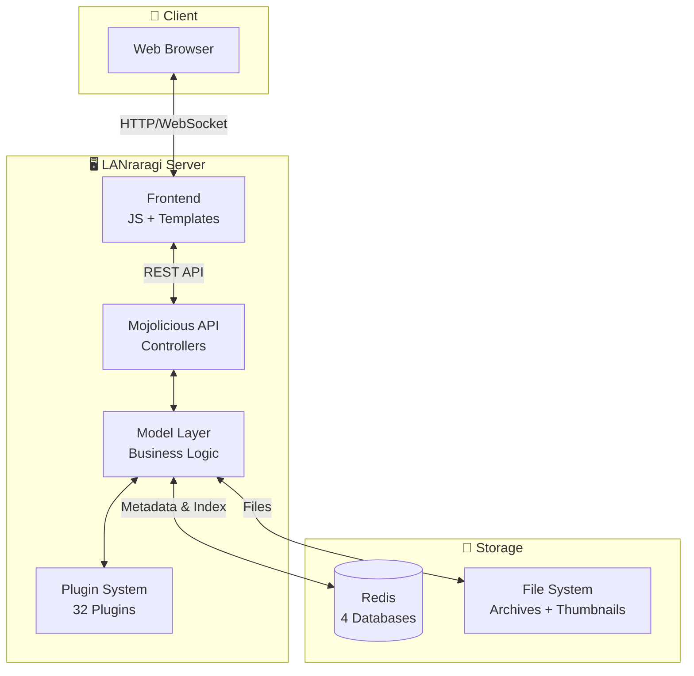

# LANraragi Technical Documentation

> **Developer-Oriented Technical Documentation Hub**

Welcome to the LANraragi internal technical documentation! This document serves as the **navigation center** for all developer-focused documentation, helping you quickly understand the project architecture, find specific implementation details, and contribute effectively.

**We warmly welcome contributions!** Whether you're fixing a bug, adding a feature, improving documentation, or translating — every contribution makes LANraragi better. Check out [CONTRIBUTING.md](../CONTRIBUTING.md) to get started.

---

## � Bilingual Documentation Structure

All technical documentation is available in both **English** and **Chinese (简体中文)**. Choose your preferred language:

| # | Topic | EN | CN | Description |
|:-:|-------|:--:|:--:|-------------|
| 01 | **Data Layer** | [EN](./en/01_data_layer.md) | [中文](./zh-CN/01_data_layer.md) | Redis multi-database architecture, complete schema for Archive, Category, Tankoubon, and Config entities |
| 02 | **API Layer** | [EN](./en/02_api.md) | [中文](./zh-CN/02_api.md) | RESTful API routing, 60+ endpoints, authentication modes, search engine internals |
| 03 | **Utilities** | [EN](./en/03_utils.md) | [中文](./zh-CN/03_utils.md) | Archive extraction, Minion task queue, image resizing, tag processing rules |
| 04 | **Plugin System** | [EN](./en/04_plugins.md) | [中文](./zh-CN/04_plugins.md) | Plugin types (metadata/login/download/script), execution flow, configuration storage |
| 05 | **Frontend** | [EN](./en/05_frontend.md) | [中文](./zh-CN/05_frontend.md) | JavaScript modules, DataTables integration, Reader component, localStorage usage |
| 06 | **Models** | [EN](./en/06_models.md) | [中文](./zh-CN/06_models.md) | Business logic layer: Search engine, Upload processing, Backup/Restore, OPDS support |
| 07 | **I18N & Templates** | [EN](./en/07_i18n.md) | [中文](./zh-CN/07_i18n.md) | Template Toolkit syntax, Locale::Maketext integration, 14 supported languages |
| 08 | **Build & Test** | [EN](./en/08_build.md) | [中文](./zh-CN/08_build.md) | Test architecture, Docker build, CI/CD workflows, configuration files |

### 📦 Supporting Documents

| Document | EN | CN | Description |
|----------|:--:|:--:|-------------|
| File List | [EN](./en/file_list.md) | [中文](./zh-CN/file_list.md) | Complete categorized list of all project files (112 Perl, 21 JS, 40 templates, etc.) |

---

## 🏗️ System Architecture

The following diagram illustrates how LANraragi's core components interact:

### 🔄 Request Processing Flow

1. **Client Request** → The browser sends an HTTP request (e.g., `/api/search?filter=artist:name`) to the Mojolicious-based API layer.
2. **Routing & Auth** → The request passes through CORS middleware and authentication checks (session/API key), then routes to the appropriate Controller.
3. **Business Logic** → Controllers delegate to Model modules (e.g., `Model::Search`), which query Redis indexes (`LRR_TITLES`, `INDEX_{tag}`) and apply caching via `LRR_SEARCHCACHE`.
4. **Plugin Execution** → For metadata fetching, the Plugin System invokes the appropriate plugin (with rate limiting and login cookie support), processes results through tag rules, and updates Redis.
5. **Response** → Results are rendered as JSON (API) or HTML (via Template Toolkit with I18N support) and returned to the client.

---

## 📚 Reading Guide

We recommend the following learning path for new contributors:

### 🚀 Getting Started (Essential)
1. **[01_data_layer.md](./en/01_data_layer.md)** — Start here! Understanding the Redis schema is fundamental to everything else.
2. **[02_api.md](./en/02_api.md)** — Learn the API structure and authentication flow.

### 🔧 Deep Dive (Based on Your Focus)
3. **[06_models.md](./en/06_models.md)** — Core business logic: Search, Upload, Backup, OPDS.
4. **[04_plugins.md](./en/04_plugins.md)** — If you're writing or modifying plugins.
5. **[05_frontend.md](./en/05_frontend.md)** — For UI/UX work and JavaScript development.

### 🌐 Infrastructure & Deployment
6. **[03_utils.md](./en/03_utils.md)** — Archive handling, task queue, image processing utilities.
7. **[07_i18n.md](./en/07_i18n.md)** — Template system and internationalization.
8. **[08_build.md](./en/08_build.md)** — Testing, Docker, CI/CD, and deployment.

---

## 🛠️ Tools

| Tool | Purpose |
|------|---------|
| **[ProjectTreeGenerator.py](./ProjectTreeGenerator.py)** | Python script to generate a complete project directory tree in Markdown format |
| **[file_list.md](./en/file_list.md)** | Pre-generated categorized file listing with statistics |

---

## 🔗 Quick Links

- **Main Project**: [LANraragi GitHub](https://github.com/Difegue/LANraragi)
- **Official Docs**: [tools/Documentation/](../tools/Documentation/)
- **API Spec (OpenAPI)**: [tools/openapi.yaml](../tools/openapi.yaml)
- **Contributing Guide**: [CONTRIBUTING.md](../CONTRIBUTING.md)
- **Translations (Weblate)**: [hosted.weblate.org](https://hosted.weblate.org/projects/lanraragi/)

---

*Last Updated: 2026-01-12*
