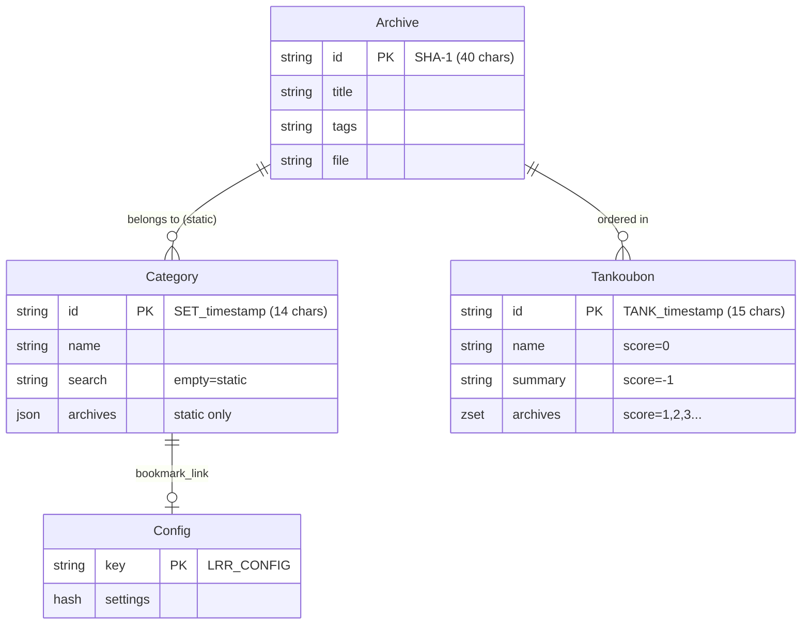

# Data Layer: Redis Schema

> **Analyzed Files**: `Redis.pm`, `Database.pm`, `Archive.pm`, `Category.pm`, `Tankoubon.pm`, `Config.pm`

---

## 📊 Redis Multi-Database Architecture

The project uses **4 Redis databases** (logical separation):

| DB Number | Config Key | Connection Method | Purpose |
|-----------|------------|-------------------|---------|
| 0 (default) | `redis_database` | `get_redis()` | Archive metadata storage |
| 1 | `redis_database_minion` | `get_minion()` | Minion task queue |
| 2 | `redis_database_config` | `get_redis_config()` | Global config + file mapping |
| 3 | `redis_database_search` | `get_redis_search()` | Search index + cache |

---

## 🗂️ Complete Schema Definition

### 1. Archive

| Storage | Key Format | Database |
|---------|------------|----------|
| Redis Hash | `{40-char-sha1}` | DB 0 (Archive) |

**Fields:**

| Field | Type | Description |
|-------|------|-------------|
| `name` | string | Original filename |
| `title` | string | Display title |
| `tags` | string | Comma-separated tags |
| `summary` | string | Description |
| `file` | string | File path (unencoded) |
| `arcsize` | int64 | File size in bytes |
| `isnew` | string | "true" or "false" |
| `progress` | int | Reading progress (page number) |
| `pagecount` | int | Total pages |
| `lastreadtime` | int64 | Unix timestamp of last read |
| `thumbjob` | string | Thumbnail job ID (Minion) |
| `thumbhash` | string | SHA-1 hash of first image |

---

### 2. Category

| Storage | Key Format | Database |
|---------|------------|----------|
| Redis Hash | `SET_{timestamp}` (14 chars) | DB 0 (Archive) |

**Two types:**
- **Static Category**: `search` is empty, `archives` stores JSON array
- **Dynamic Category**: `search` stores search query, auto-matches archives

**Fields:**

| Field | Type | Description |
|-------|------|-------------|
| `name` | string | Category name |
| `search` | string | Dynamic category search query (empty = static) |
| `pinned` | string | Is pinned |
| `archives` | JSON | Static category Archive ID list |

**Key implementation detail:**
```perl
# Archives stored as JSON array
$redis->hset( $cat_id, "archives", encode_json( \@cat_archives ) );
```

---

### 3. Tankoubon (Collection/Volume)

| Storage | Key Format | Database |
|---------|------------|----------|
| Redis **Sorted Set** | `TANK_{timestamp}` (15 chars) | DB 0 (Archive) |

**Using Sorted Set for ordered list:**

| Score | Member | Purpose |
|-------|--------|---------|
| 0 | `name_{title}` | Collection name |
| -1 | `summary_{text}` | Collection summary |
| -2 | `tags_{tags}` | Collection tags |
| 1, 2, 3... | `{archive_id}` | Ordered Archive list |

**Metadata storage mechanism:**
```perl
my %TANK_METADATA = ( "name" => 0, "summary" => -1, "tags" => -2 );
# Score 0/-1/-2 for metadata, positive integers for ordering
$redis->zadd( $tank_id, $score, $arc_id );  # Add archive
```

---

### 4. Config (Global Configuration)

| Storage | Key | Database |
|---------|-----|----------|
| Redis Hash | `LRR_CONFIG` | DB 2 (Config) |

**Main Configuration Fields:**

| Field | Type | Description |
|-------|------|-------------|
| `dirname` | string | Content directory (default ./content) |
| `thumbdir` | string | Thumbnail directory (default ./thumb) |
| `htmltitle` | string | Page title |
| `motd` | string | Welcome message |
| `theme` | string | Theme CSS |
| `pagesize` | int | Page size (default 100) |
| `password` | string | bcrypt password hash |
| `enablepass` | bool | Enable password protection |
| `apikey` | string | API key |
| `enablecors` | bool | Enable CORS |
| `devmode` | bool | Dev mode |
| `enableresize` | bool | Enable image resize |
| `usedateadded` | bool | Add date tag |
| `enablecryptofs` | bool | Encrypted file system |
| `tagruleson` | bool | Enable tag rules |
| `localprogress` | bool | Local progress |
| `authprogress` | bool | Save progress after auth |
| `sizethreshold` | int | Resize threshold |
| `readerquality` | int | Reader quality |
| `hqthumbpages` | bool | High quality thumbnails |
| `jxlthumbpages` | bool | JXL format thumbnails |
| `replacedupe` | bool | Replace duplicates |
| `replacetitles` | bool | Replace titles |
| `tagrules` | string | Tag filter rules |
| `bookmark_link` | string | Bookmark category ID |

---

## 🔍 Search Index Structure (DB 3)

| Key | Type | Purpose |
|-----|------|---------|
| `LRR_TITLES` | Sorted Set | Title index (member: `{title}\0{id}`) |
| `INDEX_{tag}` | Set | Tag index (members: archive IDs) |
| `LRR_NEW` | Set | Unread archive IDs |
| `LRR_UNTAGGED` | Set | Untagged archive IDs |
| `LRR_TANKGROUPED` | Set | Searchable items (individual archives or collections) |
| `LRR_URLMAP` | Hash | URL → Archive ID mapping |
| `LRR_SEARCHCACHE` | Hash | Search cache |
| `LRR_STATS` | Sorted Set | Statistics/tag cloud data |

---

## 🔧 Config Database Structure (DB 2)

| Key | Type | Purpose |
|-----|------|---------|
| `LRR_CONFIG` | Hash | Global configuration settings |
| `LRR_FILEMAP` | Hash | File path → Archive ID mapping (Shinobu) |
| `LRR_TAGRULES` | List | Computed tag filtering rules |
| `LRR_TOTALPAGESTAT` | String | Total pages read counter |
| `LRR_DUPLICATE_GROUPS` | Hash | Duplicate archive group data |
| `LRR_PLUGIN_{namespace}` | Hash | Per-plugin settings storage |

---

## 🔗 Entity Relationship Diagram



---

## ⚠️ Important Notes

### 1. Category vs Tankoubon Differences

| Feature | Category | Tankoubon |
|---------|----------|-----------|
| Storage Type | Hash + JSON | Sorted Set |
| Ordering | Unordered | Ordered (score) |
| Type | Static/Dynamic | Static only |
| Search Visibility | No effect | Absorbs archives |

### 2. Tankoubon Search Visibility Logic

```perl
# When adding to collection, hide individual archive from search
$redis_search->srem( "LRR_TANKGROUPED", $arc_id );
$redis_search->sadd( "LRR_TANKGROUPED", $tank_id );
```

### 3. Environment Variable Overrides

| Variable | Description |
|----------|-------------|
| `LRR_DATA_DIRECTORY` | Content folder override |
| `LRR_THUMB_DIRECTORY` | Thumbnail folder override |
| `LRR_TEMP_DIRECTORY` | Temporary folder override |
| `LRR_LOG_DIRECTORY` | Log folder override |
| `LRR_FORCE_DEBUG` | Force Debug Mode enabled |
| `LRR_NETWORK` | Network interface binding |
| `LRR_REDIS_ADDRESS` | Redis address override (priority over lrr.conf) |

---

## 🔑 Archive ID Computation

Archive IDs are computed by:
1. Reading the **first 512KB** of the archive file
2. Computing a **SHA-1 hash** from this data

> **Note**: This means two archives with identical first 512KB will have the same ID, even if the rest differs.

---

## 🔍 Search Cache Key Format

Search results are cached in `LRR_SEARCHCACHE` with composite keys:

```
{columnfilter}-{filter}-{sortkey}-{sortorder}-{newonly}
```

Example: `--title-asc-0` (no filter, sort by title ascending, not new-only)

The cache is busted when:
- Archive metadata is edited
- Archives are added/removed

---

## ✅ Summary

| Entity | Storage Type | Key Format | Database |
|--------|--------------|------------|----------|
| Archive | Hash | 40-char SHA-1 | DB 0 |
| Category | Hash | `SET_` + 10-digit timestamp | DB 0 |
| Tankoubon | Sorted Set | `TANK_` + 10-digit timestamp | DB 0 |
| Config | Hash | `LRR_CONFIG` | DB 2 |
| File Map | Hash | `LRR_FILEMAP` | DB 2 |
| Plugin Settings | Hash | `LRR_PLUGIN_{namespace}` | DB 2 |
| Search Index | Set/ZSet/Hash | Various | DB 3 |
