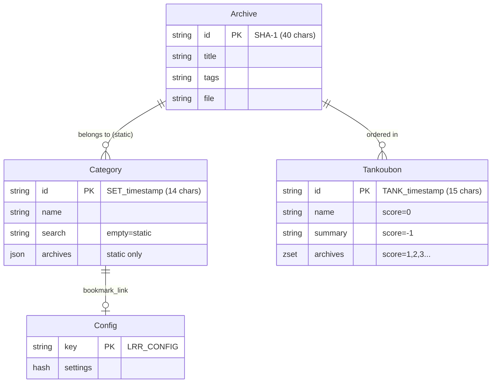

# Phase 1: Complete Redis Schema Analysis

> **Analyzed Files**: `Redis.pm`, `Database.pm`, `Archive.pm`, `Category.pm`, `Tankoubon.pm`, `Config.pm`  
> **Analysis Date**: 2026-01-11 | **Status**: ✅ Phase 1 Complete

---

## 📊 Redis Multi-Database Architecture

The project uses **4 Redis databases** (logical separation):

| DB Number | Config Key | Connection Method | Purpose |
|-----------|------------|-------------------|---------|
| 0 (default) | `redis_database` | `get_redis()` | Archive metadata storage |
| 1 | `redis_database_minion` | `get_minion()` | Minion task queue |
| 2 | `redis_database_config` | `get_redis_config()` | Global config + file mapping |
| 3 | `redis_database_search` | `get_redis_search()` | Search index + cache |

```go
// Go Connection Manager Proposal
type RedisManager struct {
    Archive *redis.Client  // DB 0
    Minion  *redis.Client  // DB 1  
    Config  *redis.Client  // DB 2
    Search  *redis.Client  // DB 3
}
```

---

## 🗂️ Complete Schema Definition

### 1. Archive

| Storage | Key Format | Database |
|---------|------------|----------|
| Redis Hash | `{40-char-sha1}` | DB 0 (Archive) |

```go
type Archive struct {
    ID           string `redis:"-"`            // Key: SHA-1(first 512KB)
    Name         string `redis:"name"`         // Filename
    Title        string `redis:"title"`        // Display title
    Tags         string `redis:"tags"`         // Comma-separated tags
    Summary      string `redis:"summary"`      // Description
    File         string `redis:"file"`         // File path (unencoded)
    ArcSize      int64  `redis:"arcsize"`      // File size
    IsNew        string `redis:"isnew"`        // "true"/"false"
    Progress     int    `redis:"progress"`     // Reading progress
    PageCount    int    `redis:"pagecount"`    // Total pages
    LastReadTime int64  `redis:"lastreadtime"` // Unix timestamp
    ThumbJob     string `redis:"thumbjob"`     // Thumbnail job ID (Minion)
    ThumbHash    string `redis:"thumbhash"`    // SHA-1 hash of first image
}
```

---

### 2. Category

| Storage | Key Format | Database |
|---------|------------|----------|
| Redis Hash | `SET_{timestamp}` (14 chars) | DB 0 (Archive) |

**Two types:**
- **Static Category**: `search` is empty, `archives` stores JSON array
- **Dynamic Category**: `search` stores search query, auto-matches archives

```go
type Category struct {
    ID       string   `json:"id"`       // Key: SET_1704931200
    Name     string   `json:"name"`     // Category name
    Search   string   `json:"search"`   // Dynamic category search query (empty=static)
    Pinned   string   `json:"pinned"`   // Is pinned
    Archives []string `json:"archives"` // Static category Archive ID list (JSON)
}
```

**Key implementation detail:**
```perl
# Archives stored as JSON array
$redis->hset( $cat_id, "archives", encode_json( \@cat_archives ) );
```

---

### 3. Tankoubon (Collection/Volume)

| Storage | Key Format | Database |
|---------|------------|----------|
| Redis **Sorted Set** | `TANK_{timestamp}` (15 chars) | DB 0 (Archive) |

**Using Sorted Set for ordered list:**

| Score | Member | Purpose |
|-------|--------|---------|
| 0 | `name_{title}` | Collection name |
| -1 | `summary_{text}` | Collection summary |
| -2 | `tags_{tags}` | Collection tags |
| 1, 2, 3... | `{archive_id}` | Ordered Archive list |

```go
type Tankoubon struct {
    ID       string   `json:"id"`       // Key: TANK_1704931200
    Name     string   `json:"name"`     // Collection name
    Summary  string   `json:"summary"`  // Summary
    Tags     string   `json:"tags"`     // Tags
    Archives []string `json:"archives"` // Ordered Archive ID list
}
```

**Metadata storage mechanism:**
```perl
my %TANK_METADATA = ( "name" => 0, "summary" => -1, "tags" => -2 );
# Score 0/-1/-2 for metadata, positive integers for ordering
$redis->zadd( $tank_id, $score, $arc_id );  # Add archive
```

---

### 4. Config (Global Configuration)

| Storage | Key | Database |
|---------|-----|----------|
| Redis Hash | `LRR_CONFIG` | DB 2 (Config) |

```go
type AppConfig struct {
    // Directory config
    Dirname     string `redis:"dirname"`     // Content directory (default ./content)
    Thumbdir    string `redis:"thumbdir"`    // Thumbnail directory (default ./thumb)
    
    // Display settings
    HTMLTitle   string `redis:"htmltitle"`   // Page title
    MOTD        string `redis:"motd"`        // Welcome message
    Theme       string `redis:"theme"`       // Theme CSS
    PageSize    int    `redis:"pagesize"`    // Page size (default 100)
    
    // Security settings
    Password    string `redis:"password"`    // bcrypt password hash
    EnablePass  bool   `redis:"enablepass"`  // Enable password protection
    APIKey      string `redis:"apikey"`      // API key
    EnableCORS  bool   `redis:"enablecors"`  // Enable CORS
    
    // Feature toggles
    DevMode        bool `redis:"devmode"`        // Dev mode
    EnableResize   bool `redis:"enableresize"`   // Enable image resize
    EnableDateAdd  bool `redis:"usedateadded"`   // Add date tag
    EnableCryptoFS bool `redis:"enablecryptofs"` // Encrypted file system
    TagRulesOn     bool `redis:"tagruleson"`     // Enable tag rules
    
    // Reader settings
    LocalProgress  bool `redis:"localprogress"`  // Local progress
    AuthProgress   bool `redis:"authprogress"`   // Save progress after auth
    SizeThreshold  int  `redis:"sizethreshold"`  // Resize threshold
    ReaderQuality  int  `redis:"readerquality"`  // Reader quality
    
    // Thumbnail settings
    HQThumbPages   bool `redis:"hqthumbpages"`   // High quality thumbnails
    JXLThumbPages  bool `redis:"jxlthumbpages"`  // JXL format thumbnails
    ReplaceDupe    bool `redis:"replacedupe"`    // Replace duplicates
    ReplaceTitles  bool `redis:"replacetitles"`  // Replace titles
    
    // Special config
    TagRules      string `redis:"tagrules"`      // Tag filter rules
    BookmarkLink  string `redis:"bookmark_link"` // Bookmark category ID
}
```

---

## 🔍 Search Index Structure (DB 3)

| Key | Type | Purpose |
|-----|------|---------|
| `LRR_TITLES` | Sorted Set | Title index (member: `{title}\0{id}`) |
| `INDEX_{tag}` | Set | Tag index (members: archive IDs) |
| `LRR_NEW` | Set | Unread archive IDs |
| `LRR_UNTAGGED` | Set | Untagged archive IDs |
| `LRR_TANKGROUPED` | Set | Searchable items (individual archives or collections) |
| `LRR_URLMAP` | Hash | URL → Archive ID mapping |
| `LRR_SEARCHCACHE` | Hash | Search cache |
| `LRR_STATS` | Sorted Set | Statistics/tag cloud data |

---

## 🔧 Config Database Structure (DB 2)

| Key | Type | Purpose |
|-----|------|---------|
| `LRR_CONFIG` | Hash | Global configuration settings |
| `LRR_FILEMAP` | Hash | File path → Archive ID mapping (Shinobu) |
| `LRR_TAGRULES` | List | Computed tag filtering rules |
| `LRR_TOTALPAGESTAT` | String | Total pages read counter |
| `LRR_DUPLICATE_GROUPS` | Hash | Duplicate archive group data |
| `LRR_PLUGIN_{namespace}` | Hash | Per-plugin settings storage |

---

## 🔗 Entity Relationship Diagram



---

## ⚠️ Go Migration Notes

### 1. Category vs Tankoubon Differences

| Feature | Category | Tankoubon |
|---------|----------|-----------|
| Storage Type | Hash + JSON | Sorted Set |
| Ordering | Unordered | Ordered (score) |
| Type | Static/Dynamic | Static only |
| Search Visibility | No effect | Absorbs archives |

### 2. Tankoubon Search Visibility Logic

```perl
# When adding to collection, hide individual archive from search
$redis_search->srem( "LRR_TANKGROUPED", $arc_id );
$redis_search->sadd( "LRR_TANKGROUPED", $tank_id );
```

### 3. Environment Variable Overrides

```go
// Some config can be overridden by env vars
os.Getenv("LRR_DATA_DIRECTORY")   // Override dirname
os.Getenv("LRR_THUMB_DIRECTORY")  // Override thumbdir
os.Getenv("LRR_REDIS_ADDRESS")    // Override redis_address
os.Getenv("LRR_FORCE_DEBUG")      // Force dev mode
```

---

## 📋 Complete Go Struct Definitions

```go
package model

// ========== Core Entities ==========

type Archive struct {
    ID           string   `json:"arcid" redis:"-"`
    Title        string   `json:"title" redis:"title"`
    Filename     string   `json:"filename" redis:"name"`
    Tags         string   `json:"tags" redis:"tags"`
    Summary      string   `json:"summary" redis:"summary"`
    FilePath     string   `json:"-" redis:"file"`
    Extension    string   `json:"extension"`
    IsNew        bool     `json:"isnew"`
    Progress     int      `json:"progress" redis:"progress"`
    PageCount    int      `json:"pagecount" redis:"pagecount"`
    LastReadTime int64    `json:"lastreadtime" redis:"lastreadtime"`
    Size         int64    `json:"size" redis:"arcsize"`
}

type Category struct {
    ID       string   `json:"id"`
    Name     string   `json:"name"`
    Search   string   `json:"search"`   // Empty=static, non-empty=dynamic
    Pinned   string   `json:"pinned"`
    Archives []string `json:"archives"` // Static category only
}

type Tankoubon struct {
    ID       string   `json:"id"`
    Name     string   `json:"name"`
    Summary  string   `json:"summary"`
    Tags     string   `json:"tags"`
    Archives []string `json:"archives"` // Ordered list
}

// ========== Redis Key Constants ==========

const (
    KeyConfig       = "LRR_CONFIG"
    KeyTitles       = "LRR_TITLES"
    KeyNew          = "LRR_NEW"
    KeyUntagged     = "LRR_UNTAGGED"
    KeyTankGrouped  = "LRR_TANKGROUPED"
    KeyURLMap       = "LRR_URLMAP"
    KeySearchCache  = "LRR_SEARCHCACHE"
    KeyFileMap      = "LRR_FILEMAP"
    KeyTagRules     = "LRR_TAGRULES"
    
    PrefixTagIndex  = "INDEX_"
    PrefixCategory  = "SET_"
    PrefixTankoubon = "TANK_"
)
```

---

## 🌍 Environment Variables (Official)

These variables can override default behavior:

| Variable | Description |
|----------|-------------|
| `LRR_DATA_DIRECTORY` | Content folder override |
| `LRR_THUMB_DIRECTORY` | Thumbnail folder override |
| `LRR_TEMP_DIRECTORY` | Temporary folder override |
| `LRR_LOG_DIRECTORY` | Log folder override |
| `LRR_FORCE_DEBUG` | Force Debug Mode enabled |
| `LRR_NETWORK` | Network interface binding |
| `LRR_REDIS_ADDRESS` | Redis address override (priority over lrr.conf) |

---

## 🔑 Archive ID Computation (Official)

Archive IDs are computed by:
1. Reading the **first 512KB** of the archive file
2. Computing a **SHA-1 hash** from this data

```perl
# From LANraragi::Utils::Database
# Archive ID = SHA-1 of first 512KB
```

> **Note**: This means two archives with identical first 512KB will have the same ID, even if the rest differs.

---

## 🔍 Search Cache Key Format (Official)

Search results are cached in `LRR_SEARCHCACHE` with composite keys:

```
{columnfilter}-{filter}-{sortkey}-{sortorder}-{newonly}
```

Example: `--title-asc-0` (no filter, sort by title ascending, not new-only)

The cache is busted when:
- Archive metadata is edited
- Archives are added/removed

---

## ✅ Phase 1 Summary

| Entity | Storage Type | Key Format | Database |
|--------|--------------|------------|----------|
| Archive | Hash | 40-char SHA-1 | DB 0 |
| Category | Hash | `SET_` + 10-digit timestamp | DB 0 |
| Tankoubon | Sorted Set | `TANK_` + 10-digit timestamp | DB 0 |
| Config | Hash | `LRR_CONFIG` | DB 2 |
| File Map | Hash | `LRR_FILEMAP` | DB 2 |
| Plugin Settings | Hash | `LRR_PLUGIN_{namespace}` | DB 2 |
| Search Index | Set/ZSet/Hash | Various | DB 3 |

**Phase 1 data layer analysis complete!** Ready to proceed to Phase 2: API Layer Analysis.

