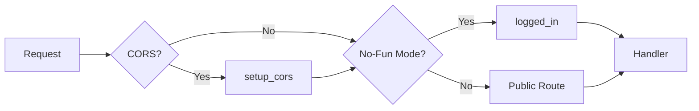
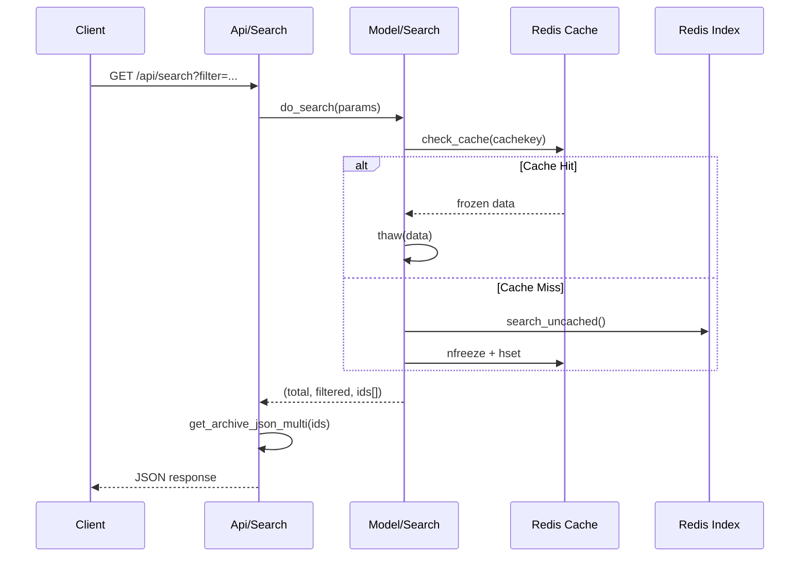

# Phase 2: API Layer Architecture Analysis

> **Analyzed Files**: `Routing.pm`, `Api/Archive.pm`, `Api/Search.pm`  
> **Analysis Date**: 2026-01-11

---

## 📊 Routing Architecture Overview

### Middleware Chain



### Route Types

| Type | Permission | Purpose |
|------|------------|---------|
| `public_routes` | No auth required | Index, Reader, Login |
| `public_api` | No auth required | Public API (can be locked by No-Fun) |
| `logged_in` | Auth required | Admin pages |
| `logged_in_api` | Auth required | Admin API |

---

## 🔗 Complete API Endpoint List

### Archive API (`/api/archives`)

| Method | Path | Auth | Handler | Description |
|--------|------|------|---------|-------------|
| GET | `/api/archives` | ❌ | `serve_archivelist` | Get all archives list |
| GET | `/api/archives/untagged` | ❌ | `serve_untagged_archivelist` | Get untagged archives |
| GET | `/api/archives/:id` | ❌ | `serve_metadata` | [Deprecated] Get metadata |
| GET | `/api/archives/:id/metadata` | ❌ | `serve_metadata` | Get archive metadata |
| GET | `/api/archives/:id/thumbnail` | ❌ | `serve_thumbnail` | Get thumbnail |
| GET | `/api/archives/:id/download` | ❌ | `serve_file` | Download original file |
| GET | `/api/archives/:id/page` | ❌ | `serve_page` | Get specific page |
| GET | `/api/archives/:id/files` | ❌ | `get_file_list` | Get file list |
| GET | `/api/archives/:id/categories` | ❌ | `get_categories` | Get belonging categories |
| GET | `/api/archives/:id/tankoubons` | ❌ | `get_tankoubons_file` | Get belonging collections |
| PUT | `/api/archives/upload` | ✅ | `create_archive` | Upload new archive |
| PUT | `/api/archives/:id/metadata` | ✅ | `update_metadata` | Update metadata |
| PUT | `/api/archives/:id/thumbnail` | ✅ | `update_thumbnail` | Update thumbnail |
| PUT | `/api/archives/:id/progress/:page` | ⚙️ | `update_progress` | Update reading progress |
| POST | `/api/archives/:id/files/thumbnails` | ❌ | `generate_page_thumbnails` | Generate page thumbnails |
| DELETE | `/api/archives/:id` | ✅ | `delete_archive` | Delete archive |
| DELETE | `/api/archives/:id/isnew` | ❌ | `clear_new` | Clear new flag |

> ⚙️ = Configurable (`enable_authprogress`)

---

### Search API (`/api/search`)

| Method | Path | Auth | Handler | Description |
|--------|------|------|---------|-------------|
| GET | `/search` | ❌ | `handle_datatables` | DataTables format (internal) |
| GET | `/api/search` | ❌ | `handle_api` | Public search API |
| GET | `/api/search/random` | ❌ | `get_random_archives` | Get random archives |
| DELETE | `/api/search/cache` | ✅ | `clear_cache` | Clear search cache |

#### Search API Parameters

| Param | Type | Default | Description |
|-------|------|---------|-------------|
| `filter` | string | - | Search keywords (see syntax below) |
| `category` | string | "" | Category ID |
| `start` | int | 0 | Pagination offset. **Use `-1` to get full unpaged results** (since 0.8.2) |
| `sortby` | string | "title" | Sort field: `title` or `lastread` (if server-side progress enabled) |
| `order` | string | "asc" | Sort direction (asc/desc) |
| `newonly` | bool | false | New archives only |
| `untaggedonly` | bool | false | Untagged only |
| `groupby_tanks` | bool | false | Group by collections |

#### Search Query Syntax (Official)

| Syntax | Description | Example |
|--------|-------------|---------|
| `keyword` | Fuzzy match title/tags | `fate` |
| `"..."` | Exact string search | `"fate grand order"` |
| `?` or `_` | Single character wildcard | `fate_go` |
| `*` or `%` | Multi-character wildcard | `fate*` |
| `-keyword` | Exclude term | `-yaoi` |
| `$` suffix | Exact tag match (ignores misc) | `artist:rco$` |
| `namespace:value` | Namespace search | `artist:wada` |
| `pages:>N` | Page count filter | `pages:>=50` |
| `read:>N` | Read progress filter | `read:10` |

#### Search Response Codes

| Code | Description |
|------|-------------|
| `200` | Success with results |
| `204` | Search engine not initialized (wait a few seconds) |

#### Random Search Parameters (`/api/search/random`)

| Param | Type | Default | Description |
|-------|------|---------|-------------|
| `filter` | string | - | Search keywords |
| `category` | string | "" | Category ID |
| `newonly` | bool | false | New archives only |
| `untaggedonly` | bool | false | Untagged only |
| `groupby_tanks` | bool | false | Group by collections |
| `count` | int | 5 | Number of random archives to return |

---

### Category API (`/api/categories`)

| Method | Path | Auth | Handler |
|--------|------|------|---------|
| GET | `/api/categories` | ❌ | `get_category_list` |
| GET | `/api/categories/:id` | ❌ | `get_category` |
| GET | `/api/categories/bookmark_link` | ❌ | `get_bookmark_link` |
| PUT | `/api/categories` | ✅ | `create_category` |
| PUT | `/api/categories/:id` | ✅ | `update_category` |
| PUT | `/api/categories/:id/:archive` | ✅ | `add_to_category` |
| PUT | `/api/categories/bookmark_link/:id` | ✅ | `update_bookmark_link` |
| DELETE | `/api/categories/:id` | ✅ | `delete_category` |
| DELETE | `/api/categories/:id/:archive` | ✅ | `remove_from_category` |
| DELETE | `/api/categories/bookmark_link` | ✅ | `remove_bookmark_link` |

---

### Tankoubon API (`/api/tankoubons`)

| Method | Path | Auth | Handler |
|--------|------|------|---------|
| GET | `/api/tankoubons` | ❌ | `get_tankoubon_list` |
| GET | `/api/tankoubons/:id` | ❌ | `get_tankoubon` |
| PUT | `/api/tankoubons` | ✅ | `create_tankoubon` |
| PUT | `/api/tankoubons/:id` | ✅ | `update_tankoubon` |
| PUT | `/api/tankoubons/:id/:archive` | ✅ | `add_to_tankoubon` |
| DELETE | `/api/tankoubons/:id` | ✅ | `delete_tankoubon` |
| DELETE | `/api/tankoubons/:id/:archive` | ✅ | `remove_from_tankoubon` |

---

### Database API (`/api/database`)

| Method | Path | Auth | Handler |
|--------|------|------|---------|
| GET | `/api/database/backup` | ✅ | `serve_backup` |
| GET | `/api/database/stats` | ❌ | `serve_tag_stats` |
| DELETE | `/api/database/isnew` | ✅ | `clear_new_all` |
| POST | `/api/database/drop` | ✅ | `drop_database` |
| POST | `/api/database/clean` | ✅ | `clean_database` |

---

### Other APIs

#### Shinobu API (`/api/shinobu`)
| Method | Path | Auth | Handler |
|--------|------|------|---------|
| GET | `/api/shinobu` | ✅ | `shinobu_status` |
| POST | `/api/shinobu/stop` | ✅ | `stop_shinobu` |
| POST | `/api/shinobu/restart` | ✅ | `restart_shinobu` |
| POST | `/api/shinobu/rescan` | ✅ | `reset_filemap` |

#### Minion API (`/api/minion`)
| Method | Path | Auth | Handler |
|--------|------|------|---------|
| GET | `/api/minion/:jobid` | ❌ | `minion_job_status` |
| GET | `/api/minion/:jobid/detail` | ✅ | `minion_job_detail` |
| POST | `/api/minion/:jobname/queue` | ✅ | `queue_minion_job` |

#### OPDS API (`/api/opds`)
| Method | Path | Auth | Handler |
|--------|------|------|---------|
| GET | `/api/opds` | ❌ | `serve_opds_catalog` |
| GET | `/api/opds/:id` | ❌ | `serve_opds_item` |
| GET | `/api/opds/:id/pse` | ❌ | `serve_opds_page` |

#### Misc API
| Method | Path | Auth | Handler |
|--------|------|------|---------|
| GET | `/api/info` | ❌ | `serve_serverinfo` |
| GET | `/api/plugins/:type` | ✅ | `list_plugins` |
| POST | `/api/plugins/use` | ✅ | `use_plugin_sync` |
| POST | `/api/plugins/queue` | ✅ | `use_plugin_async` |
| POST | `/api/download_url` | ✅ | `download_url` |
| POST | `/api/regen_thumbs` | ✅ | `regen_thumbnails` |
| DELETE | `/api/tempfolder` | ✅ | `clean_tempfolder` |

---

## 🔐 Authentication Modes

### 1. Password Protection (Session)
```perl
$public_routes->post('/login')->to('login#check');
$logged_in = $public_routes->under('/')->to('login#logged_in');
```

### 2. API Key
```perl
# Checked in login#logged_in_api
# Header format: "Bearer " + base64(api_key)
Authorization: Bearer {base64_encoded_api_key}

# Alternative: query parameter (undocumented, mainly for OPDS)
?key={api_key}
```

### 3. No-Fun Mode
Forces all public routes to require authentication:
```perl
if ( $self->LRR_CONF->enable_nofun ) {
    $public_routes = $logged_in;
    $public_api = $logged_in_api;
}
```

---

## 📝 Response Format

### Success Response
```json
{
    "operation": "update_metadata",
    "success": 1,
    "message": "Updated metadata for \"Title\"!"
}
```

### Error Response
```json
{
    "operation": "update_metadata",
    "success": 0,
    "error": "No archive ID specified."
}
```

### List Response
```json
{
    "recordsTotal": 100,
    "recordsFiltered": 25,
    "data": [...]
}
```

---

## 🔒 Concurrent Lock Mechanism

Using `exec_with_lock` to prevent concurrent writes:

```perl
exec_with_lock( $self, $redis, "archive-write:$id", "operation", $id, sub {
    # Critical section code
});
```

**Lock Types:**
- `upload:{filename}` - Upload lock
- `archive-write:{id}` - Archive modification lock

---

## 🏗️ Go Router Design Proposal

```go
package router

import (
    "github.com/gin-gonic/gin"
)

func SetupRouter(cfg *config.Config) *gin.Engine {
    r := gin.New()
    
    // Middleware
    r.Use(gin.Logger(), gin.Recovery())
    if cfg.EnableCORS {
        r.Use(CORSMiddleware())
    }
    
    // Public routes
    public := r.Group("/api")
    {
        // Archive
        public.GET("/archives", archiveHandler.List)
        public.GET("/archives/:id/metadata", archiveHandler.GetMetadata)
        public.GET("/archives/:id/thumbnail", archiveHandler.GetThumbnail)
        public.GET("/archives/:id/download", archiveHandler.Download)
        
        // Search
        public.GET("/search", searchHandler.Search)
        public.GET("/search/random", searchHandler.Random)
        
        // Category & Tankoubon
        public.GET("/categories", categoryHandler.List)
        public.GET("/tankoubons", tankoubonHandler.List)
    }
    
    // Authenticated routes
    authed := r.Group("/api")
    authed.Use(AuthMiddleware(cfg))
    {
        authed.PUT("/archives/upload", archiveHandler.Upload)
        authed.PUT("/archives/:id/metadata", archiveHandler.UpdateMetadata)
        authed.DELETE("/archives/:id", archiveHandler.Delete)
        // ...
    }
    
    return r
}

// Go Handler Interface Proposal
type ArchiveHandler interface {
    List(c *gin.Context)
    GetMetadata(c *gin.Context)
    GetThumbnail(c *gin.Context)
    Download(c *gin.Context)
    Upload(c *gin.Context)
    UpdateMetadata(c *gin.Context)
    Delete(c *gin.Context)
}
```

---

## ✅ Phase 2 Analysis Summary

| Finding | Details |
|---------|---------|
| **Total Endpoints** | 60+ (API + Pages) |
| **Auth Modes** | Session + API Key + No-Fun |
| **Response Format** | JSON with operation/success |
| **Concurrency Control** | Redis distributed locks |
| **Special Features** | OPDS, WebSocket (batch) |

---

## 🔍 Search Engine Deep Analysis

### Search Flow



### Search Syntax

| Syntax | Example | Description |
|--------|---------|-------------|
| Regular Search | `artist:name` | Fuzzy match |
| Exact Search | `"artist:name"` or `artist:name$` | Exact match |
| Exclude Tag | `-tag:value` | Exclude result |
| Wildcards | `?` `_` (single char), `*` `%` (multi char) | |
| Page Search | `pages:>20`, `pages:<=30` | Page range |
| Read Search | `read:>0` | Reading progress |

### Cache Mechanism

```perl
# Cache Key Format
$cachekey = "$category_id-$filter-$sortkey-$sortorder-$newonly-$untaggedonly-$grouptanks"

# Serialization: Storable (nfreeze/thaw)
$redis->hset( "LRR_SEARCHCACHE", $cachekey, nfreeze \@filtered );
```

**Cache Invalidation:**
- Call `invalidate_cache()` to delete `LRR_SEARCHCACHE`
- `lastread` sorting does not use cache

### Sort Optimization (Lua Script)

```lua
-- Batch get lastreadtime
local result = {}
for i=1,#ARGV do
    local id = ARGV[i]
    local value = redis.call('HGET', id, 'lastreadtime')
    result[i] = {id, value or "0"}
end
return cjson.encode(result)
```

**Go Implementation Suggestion:**
```go
// Use Redis Pipeline instead of Lua
pipe := rdb.Pipeline()
for _, id := range ids {
    pipe.HGet(ctx, id, "lastreadtime")
}
results, _ := pipe.Exec(ctx)
```

### Index Utilization

| Sort/Filter | Index Used |
|-------------|-----------|
| Title Search | `LRR_TITLES` (Sorted Set ZSCAN) |
| Tag Search | `INDEX_{tag}` (Set SMEMBERS) |
| New Archives | `LRR_NEW` (Set) |
| Untagged | `LRR_UNTAGGED` (Set) |
| Collection Grouping | `LRR_TANKGROUPED` (Set) |

---

## 🏗️ Go Search Engine Design Proposal

```go
package search

type SearchParams struct {
    Filter       string
    CategoryID   string
    Start        int
    SortKey      string
    SortOrder    bool // true = desc
    NewOnly      bool
    UntaggedOnly bool
    GroupTanks   bool
}

type SearchResult struct {
    Total    int               `json:"recordsTotal"`
    Filtered int               `json:"recordsFiltered"`
    Data     []model.Archive   `json:"data"`
}

type SearchEngine interface {
    Search(ctx context.Context, params SearchParams) (*SearchResult, error)
    InvalidateCache(ctx context.Context) error
}

// Token represents a search term
type Token struct {
    Tag     string
    IsNeg   bool // Exclude
    IsExact bool // Exact match
}

func ParseFilter(filter string) []Token {
    // Implement search syntax parsing
}
```
