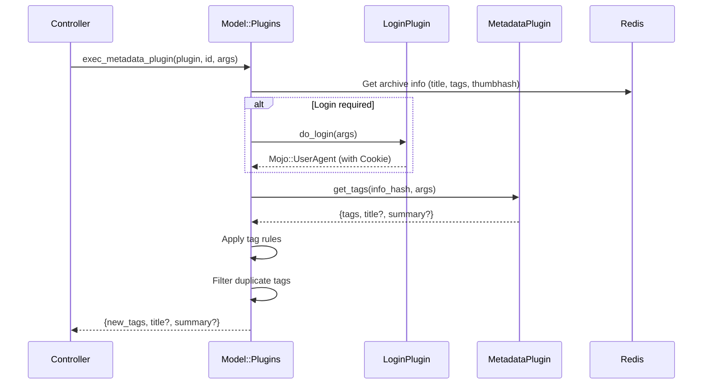

# Phase 4: Plugin System Architecture Analysis

> **Analyzed Files**: `Utils/Plugins.pm`, `Model/Plugins.pm`, `Plugin/Metadata/EHentai.pm`  
> **Analysis Date**: 2026-01-11

---

## 🔌 Plugin System Overview

### Plugin Discovery Mechanism

Uses `Module::Pluggable` for automatic plugin discovery:
```perl
use Module::Pluggable require => 1, search_path => ['LANraragi::Plugin'];
```

**Go Alternatives:**
1. Compile-time registration (recommended): Plugins call register function in `init()`
2. Reflection scan: Use `reflect` package to scan types implementing interface
3. Plugin directory: Scan `plugins/` directory to load `.so` files

---

## 📋 Plugin Type Definitions

| Type | Required Method | Purpose | Count |
|------|----------------|---------|-------|
| `metadata` | `get_tags` | Fetch archive metadata | 21 |
| `login` | `do_login` | Website authentication | 4 |
| `download` | `provide_url` | Download external resources | 3 |
| `script` | `run_script` | General script execution | 3 |

---

## 📝 plugin_info Contract

Every plugin must implement `plugin_info()` returning metadata:

```perl
sub plugin_info {
    return (
        name        => "E-Hentai",           # Display name
        type        => "metadata",           # Plugin type
        namespace   => "ehplugin",           # Unique identifier
        author      => "Difegue",            # Author
        version     => "2.6",                # Version number
        description => "Searches...",        # HTML description
        icon        => "data:image/png;...", # Base64 icon
        
        # Optional fields
        login_from  => "ehlogin",            # Dependent login plugin
        cooldown    => 4,                    # Cooldown time (seconds)
        url_regex   => "e-hentai\\.org",     # Download plugin URL match
        oneshot_arg => "E-H Gallery URL",    # One-shot execution param description
        
        # Parameter definitions (array or Hash)
        parameters  => [
            { type => "string", desc => "Language" },
            { type => "bool",   desc => "Use thumbnails" },
        ],
    );
}
```

### Go Struct Definition

```go
type PluginInfo struct {
    Name        string       `json:"name"`
    Type        PluginType   `json:"type"`
    Namespace   string       `json:"namespace"`
    Author      string       `json:"author"`
    Version     string       `json:"version"`
    Description string       `json:"description"`
    Icon        string       `json:"icon"`
    
    // Optional
    LoginFrom   string       `json:"login_from,omitempty"`
    Cooldown    int          `json:"cooldown,omitempty"`
    URLRegex    string       `json:"url_regex,omitempty"`
    OneshotArg  string       `json:"oneshot_arg,omitempty"`
    Parameters  []Parameter  `json:"parameters,omitempty"`
}

type PluginType string

const (
    PluginTypeMetadata PluginType = "metadata"
    PluginTypeLogin    PluginType = "login"
    PluginTypeDownload PluginType = "download"
    PluginTypeScript   PluginType = "script"
)

type Parameter struct {
    Type         string `json:"type"`  // "string", "bool", "int"
    Desc         string `json:"desc"`
    DefaultValue any    `json:"default_value,omitempty"`
}
```

---

## 🔧 Plugin Execution Flow

### Login Plugin (Official)

Required method: `do_login`

| Input | Description |
|-------|-------------|
| `$params` | User-defined plugin parameters |

| Output | Description |
|--------|-------------|
| `Mojo::UserAgent` | Configured UA object with cookies |

```perl
sub do_login {
    shift;
    my ($params) = @_;
    my $ua = Mojo::UserAgent->new;
    $ua->cookie_jar->add(...);  # Add login cookies
    return $ua;
}
```

### Download Plugin (Official)

Required method: `provide_url`
Required metadata: `url_regex`

| Input (`$lrr_info`) | Description |
|---------------------|-------------|
| `url` | The URL to download |
| `user_agent` | Pre-configured Mojo::UserAgent |
| `tempdir` | Temp directory for local file assembly |

| Output | Description |
|--------|-------------|
| `download_url => "..."` | Direct download URL |
| `file_path => "..."` | Local file path (already downloaded) |

```perl
sub provide_url {
    shift;
    my $lrr_info = shift;
    my $url = $lrr_info->{url};
    # ... process URL ...
    return ( download_url => "https://direct.link/file.zip" );
    # OR
    return ( file_path => "/path/to/local/file.zip" );
}
```

### Script Plugin (Official)

Required method: `run_script`

| Input (`$lrr_info`) | Description |
|---------------------|-------------|
| `oneshot_param` | Runtime argument from user |
| `user_agent` | Pre-configured Mojo::UserAgent |

| Output | Description |
|--------|-------------|
| Any hash | Returned directly to caller |
| `error => "..."` | Error message |

```perl
sub run_script {
    shift;
    my ($lrr_info, $params) = @_;
    # ... perform operations ...
    return ( total => $count, ids => \@list );
}
```

### Metadata Plugin



### info_hash Passed to Plugin

```go
type PluginContext struct {
    ArchiveID     string              `json:"archive_id"`
    ArchiveTitle  string              `json:"archive_title"`
    ExistingTags  string              `json:"existing_tags"`
    ThumbnailHash string              `json:"thumbnail_hash"`
    FilePath      string              `json:"file_path"`
    UserAgent     *http.Client        `json:"user_agent"`
    OneshotParam  string              `json:"oneshot_param"`
}
```

### $lrr_info Fields (Official Documentation)

| Field | Description |
|-------|-------------|
| `archive_id` | The internal ID of the archive (40-char SHA1) |
| `archive_title` | The title of the archive, as entered by the User |
| `existing_tags` | The tags already in LRR for this archive |
| `thumbnail_hash` | SHA-1 hash of the first image of the archive |
| `file_path` | The filesystem path to the archive |
| `oneshot_param` | Value of one-shot argument if set by User |
| `user_agent` | Mojo::UserAgent object for web requests (pre-configured with login cookies if depending on Login plugin) |

---

## 💾 Plugin Configuration Storage

### Redis Key Format

```
LRR_PLUGIN_{NAMESPACE}  (Hash)
├── enabled: "1" | "0"
├── param1: "value1"
├── param2: "value2"
└── customargs: "[...]"  (legacy format, JSON array)
```

### Parameter Migration (Old → New)

```perl
# Old format: positional params (JSON array)
customargs => '["value1", "value2"]'

# New format: named params (Hash fields)
param_name => "value"
```

### to_named_params Field (v0.9.3+)

When converting a plugin from positional to named parameters, add `to_named_params` to preserve existing user configuration:

```perl
# Add to plugin_info to convert old config automatically
to_named_params => ['doomsday', 'iterations'],  # Old param order
parameters => {
    'iterations' => {type => "int",  desc => "Number of iterations"},
    'doomsday'   => {type => "bool", desc => "Enable DOOMSDAY"},
    'salvation'  => {type => "bool", desc => "New param (not in migration)"}
}
```

> **Note**: `to_named_params` is only needed for the first load after conversion. It can be removed in later versions.

---

## 🧪 EHentai Plugin Analysis (Representative Example)

### Plugin Features

1. **source tag priority**: Use existing `source:e-hentai.org/g/...` if available
2. **Thumbnail reverse search**: Search using SHA-1 hash
3. **gID title search**: Extract `[1234567]` from title
4. **Title text search**: Fallback approach

### Search Strategy

```perl
# Priority: oneshot_param > source tag > thumbnail search > gID search > title search
if ( $lrr_info->{oneshot_param} =~ /g\/(\d+)\/([0-z]+)/ ) { ... }
elsif ( $lrr_info->{existing_tags} =~ /source:.*e-hentai.org\/g\/(\d+)\/([0-z]+)/ ) { ... }
else { lookup_gallery(...) }
```

### Rate Limiting

```perl
cooldown => 4  # 4 second cooldown

# Detect EH rate limit warning
if ( index( $dom->to_string, "You are opening" ) != -1 ) {
    my $rand = 15 + int( rand( 51 - 15 ) );  # 15-50 second random wait
    sleep($rand);
}
```

---

## 🏗️ Go Plugin System Design

### Approach Comparison

| Approach | Pros | Cons |
|----------|------|------|
| **Go Interface** | Type-safe, best performance | Requires recompilation |
| **Go Plugin (.so)** | Dynamic loading | Linux only, version sensitive |
| **Yaegi (Go interpreter)** | Hot reload, type-safe | Performance loss |
| **Lua (gopher-lua)** | Lightweight, sandboxed | Learning curve |
| **JavaScript (goja)** | Rich ecosystem | Performance loss |

### Recommended: Go Interface + Registration Pattern

```go
package plugin

// Plugin registry
var registry = make(map[string]Plugin)

func Register(p Plugin) {
    info := p.Info()
    registry[info.Namespace] = p
}

func Get(namespace string) (Plugin, bool) {
    p, ok := registry[namespace]
    return p, ok
}

// Core interfaces
type Plugin interface {
    Info() PluginInfo
}

type MetadataPlugin interface {
    Plugin
    GetTags(ctx context.Context, info *PluginContext, params map[string]any) (*MetadataResult, error)
}

type LoginPlugin interface {
    Plugin
    DoLogin(ctx context.Context, params map[string]any) (*http.Client, error)
}

type DownloadPlugin interface {
    Plugin
    ProvideURL(ctx context.Context, info *DownloadContext, params map[string]any) (*DownloadResult, error)
}

type ScriptPlugin interface {
    Plugin
    RunScript(ctx context.Context, info *ScriptContext, params map[string]any) (map[string]any, error)
}
```

### Plugin Example (EHentai)

```go
package ehentai

import (
    "context"
    "regexp"
    "github.com/lanraragi/plugin"
)

func init() {
    plugin.Register(&EHentaiPlugin{})
}

type EHentaiPlugin struct{}

func (p *EHentaiPlugin) Info() plugin.PluginInfo {
    return plugin.PluginInfo{
        Name:       "E-Hentai",
        Type:       plugin.PluginTypeMetadata,
        Namespace:  "ehplugin",
        Author:     "Difegue",
        Version:    "2.6",
        LoginFrom:  "ehlogin",
        Cooldown:   4,
        Parameters: []plugin.Parameter{
            {Type: "string", Desc: "Forced language"},
            {Type: "bool", Desc: "Fetch using thumbnail"},
        },
    }
}

func (p *EHentaiPlugin) GetTags(ctx context.Context, info *plugin.PluginContext, params map[string]any) (*plugin.MetadataResult, error) {
    // Implement search logic...
    return &plugin.MetadataResult{
        Tags:  "artist:someone, category:doujinshi",
        Title: "New Title",
    }, nil
}
```

---

## 📝 Plugin Code Examples (Official)

### Logging
```perl
use LANraragi::Utils::Logging qw(get_plugin_logger);
my $logger = get_plugin_logger();

$logger->debug("Only shows in Debug Mode");
$logger->info("Normal log");
$logger->warn("Warning");
$logger->error("Error");
```

### HTTP Requests
```perl
my $ua = $lrr_info->{user_agent};

# GET request
$ua->get("http://example.com")->result->body;

# POST JSON request
my $rep = $ua->post(
    "https://api.example.com" => json => { key => "value" }
)->result;
my $json = $rep->json;  # Decoded hash
```

### Read Redis Values
```perl
my $redis = LANraragi::Model::Config->get_redis;
my $value = $redis->get("key");
```

### Extract Files from Archive
```perl
use LANraragi::Utils::Archive qw(is_file_in_archive extract_file_from_archive);

my $info_path = is_file_in_archive($file, "info.json");
if ($info_path) {
    my $filepath = extract_file_from_archive($file, $info_path);
    # Use extracted file...
    unlink $filepath;  # Delete when done
}
```

---

## ✅ Phase 4 Analysis Summary

| Finding | Details |
|---------|---------|
| **Plugin Discovery** | Module::Pluggable auto-scan |
| **4 Types** | metadata, login, download, script |
| **Config Storage** | Redis Hash (`LRR_PLUGIN_{NS}`) |
| **Login Dependency** | `login_from` field specifies |
| **Rate Limiting** | `cooldown` field + dynamic wait |
| **Param Migration** | Positional → Named params |

### Migration Suggestions

1. **Go Interface pattern**: Compile-time registration, type-safe
2. **Preserve plugin metadata format**: For frontend compatibility
3. **HTTP Client reuse**: Login plugin returns configured Client
4. **Context passing**: Support timeout and cancellation

