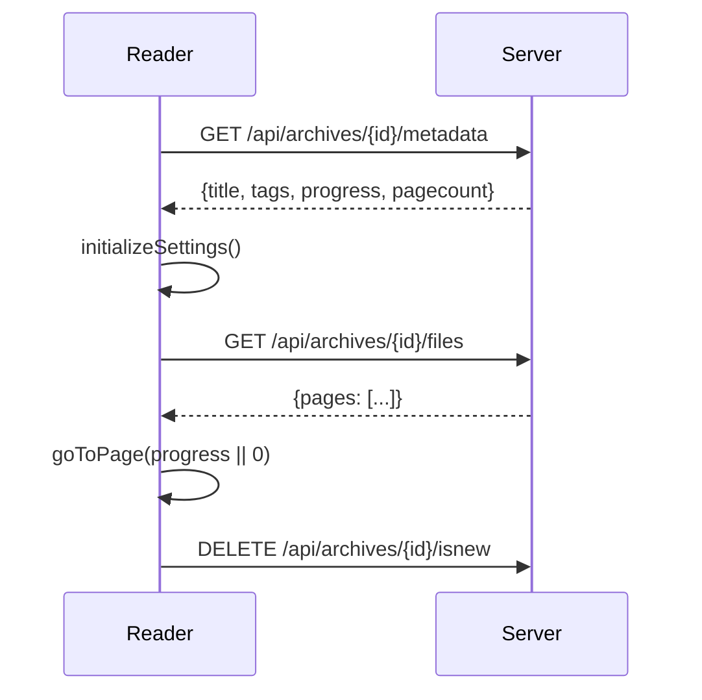
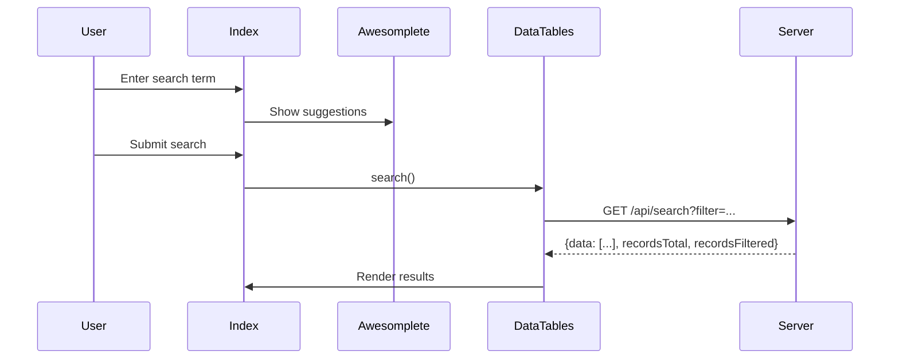

# Phase 5: Frontend Architecture Analysis

> Analysis Date: 2026-01-11

This document analyzes LANraragi's JavaScript frontend architecture, providing technical reference for Go refactoring or frontend modernization.

---

## 📊 Core Module Overview

| File | Lines | Main Responsibility | Key Dependencies |
|------|-------|---------------------|------------------|
| `common.js` | 486 | Global utilities, UI component building | jQuery, React (toast), SweetAlert2 |
| `server.js` | 346 | API client, async task polling | fetch API, LRR namespace |
| `reader.js` | 1143 | Reader core logic | fscreen (fullscreen), LRR/Server |
| `index.js` | 1040 | Index/list page logic | DataTables, Swiper, Awesomplete |
| `index_datatables.js` | 413 | **DataTables config & rendering** | DataTables, tippy.js |
| `batch.js` | ~350 | Batch tag operations | Server API |
| `category.js` | ~300 | Category management page | Server API |
| `edit.js` | ~250 | Metadata editing | Server API |
| `upload.js` | ~230 | Upload functionality | Server API |
| `duplicates.js` | ~300 | Duplicate detection page | Server API |
| `config.js` | ~180 | Settings page | Server API |
| `stats.js` | ~50 | Statistics page charts | Server API |
| `plugins.js` | ~35 | Plugin management | Server API |
| `logs.js` | ~45 | Logs page | Server API |
| `backup.js` | ~30 | Backup page | Server API |

---

## 📊 index_datatables.js - Table Core (16KB)

### Module Structure

```javascript
const IndexTable = {
    dataTable: {},           // DataTables instance
    originalTitle: "",       // Original page title
    isComingFromPopstate: false,  // Browser history state
    currentSearch: ""        // Current search term
};
```

### DataTables Configuration

```javascript
IndexTable.dataTable = $(".datatables").DataTable({
    serverSide: true,        // Server-side pagination
    processing: true,
    ajax: { url: "search", cache: true },
    deferRender: true,       // Deferred rendering
    lengthChange: false,
    pageLength: Index.pageSize,
    order: [[0, "asc"]],     // Default sort by title
    columns: [
        { data: null, name: "title", render: IndexTable.renderTitle },
        { data: "tags", name: "customColumn1", render: IndexTable.renderColumn },
        { data: "tags", name: "tags", orderable: false, render: IndexTable.renderTags }
    ]
});
```

### Dual View Mode

| Mode | Storage Key | Rendering Method |
|------|-------------|------------------|
| **List Mode** | `indexViewMode=0` | Standard `<table>` rendering |
| **Thumbnail Mode** | `indexViewMode=1` | Dynamically create `#thumbs_container` |

```javascript
IndexTable.createdRow = function(row, data) {
    row.id = data.arcid;
    row.classList.add('context-menu');
    if (localStorage.indexViewMode === "1") {
        // Thumbnail mode: create thumbnail div
        $("#thumbs_container").append(LRR.buildThumbnailDiv(data));
    }
};
```

### URL State Management

Supports pushState/popState to persist search state:

```javascript
// Build URL parameters
IndexTable.buildURLParameters = function() {
    return `?p=${page}&sort=${sortby}&sortdir=${sortorder}&q=${search}&c=${category}`;
};

// Consume URL parameters
IndexTable.consumeURLParameters = function() {
    const params = new URLSearchParams(window.location.search);
    if (params.has("q")) IndexTable.currentSearch = params.get("q");
    if (params.has("c")) Index.selectedCategory = params.get("c");
    IndexTable.doSearch(params.get("p") - 1);
};
```

## 🔧 Architecture Analysis

### 1. LRR Global Namespace (`common.js`)

Core utility class, referenced by all pages:

```javascript
const LRR = {};

// URL wrapper class - handles Base URL
LRR.apiURL = class {
    static base_url = _get_baseurl_cookie();
    constructor(load_url) { ... }
    toString() { return LRR.apiURL.base_url + this.load_url; }
};
```

**Key Functions:**

| Function | Purpose |
|----------|---------|
| `isUserLogged()` | Get login state from `data-user-logged` |
| `splitTagsByNamespace(tags)` | Parse `namespace:tag` format |
| `buildTagsDiv(tags)` | Generate clickable tag HTML |
| `buildThumbnailDiv(data)` | Build thumbnail card component |
| `getProgress(arcdata)` | Get reading progress (local/server) |
| `showErrorToast()` / `toast()` | Toast notifications (migrated to react-toastify) |

**Data Flow:**
```
Template (tt2) → data-* attributes → LRR.isUserLogged() → JS logic
Cookie (lrr_baseurl) → LRR.apiURL.base_url → API requests
localStorage → Reading progress/User preferences → UI state
```

---

### 2. API Client (`server.js`)

Encapsulates all backend communication:

```javascript
const Server = {};

// Generic API call
Server.callAPI(endpoint, method, successMessage, errorMessage, successCallback)

// API call with request body
Server.callAPIBody(endpoint, method, body, successMessage, errorMessage, successCallback)

// Minion task polling
Server.checkJobStatus(jobId, useDetail, callback, failureCallback, progressCallback)
```

**API Endpoint Usage Statistics:**

| Endpoint Pattern | Call Location | HTTP Method |
|------------------|---------------|-------------|
| `/api/archives/{id}/metadata` | reader, index, edit | GET/PUT |
| `/api/archives/{id}/files` | reader | GET |
| `/api/archives/{id}/thumbnail` | index | GET/PUT |
| `/api/archives/{id}/progress/{page}` | reader | PUT |
| `/api/categories/{id}/{arcId}` | reader, index | PUT/DELETE |
| `/api/minion/{jobId}` | server | GET |
| `/api/search` | index | GET |
| `/api/database/stats` | index | GET |

**Error Handling Pattern:**
```javascript
fetch(endpoint)
    .then(response => response.ok ? response.json() : { success: 0, error: ... })
    .then(data => { if (data.success) callback(data); else throw Error(data.error); })
    .catch(error => LRR.showErrorToast(errorMessage, error));
```

---

### 3. Reader Module (`reader.js`)

**State Management:**
```javascript
Reader.id = "";              // Current Archive ID
Reader.currentPage = -1;     // Current page (0-indexed)
Reader.pages = [];           // Page URL list
Reader.preloadedImg = {};    // Preloaded image cache
Reader.mangaMode = false;    // Right→Left reading
Reader.doublePageMode = false; // Double page mode
Reader.infiniteScroll = false; // Infinite scroll
```

**Keyboard Shortcuts:**

| Key | Function |
|-----|----------|
| ← / A | Previous page |
| → / D | Next page |
| Space | Scroll/Page turn (smart detection) |
| M | Toggle manga mode |
| P | Toggle double page mode |
| F | Fullscreen |
| Q | Open thumbnail overlay |
| B | Toggle bookmark |
| R | Random comic |

**Image Preload Strategy:**
```javascript
Reader.preloadImages = function () {
    let preloadNext = Reader.preloadCount;  // Default preload count
    let preloadPrev = Reader.preloadCount == 0 ? 0 : 1;
    
    // Double in double page mode
    if (Reader.doublePageMode) { preloadNext *= 2; preloadPrev *= 2; }
    
    for (let i = 1; i <= preloadNext; i++) {
        Reader.loadImage(Reader.currentPage + i);
    }
};
```

**Progress Tracking Logic:**
```javascript
Reader.updateProgress = function () {
    if (Reader.authenticateProgress && LRR.isUserLogged()) {
        // Logged in user → Server storage
        Server.callAPI(`/api/archives/${Reader.id}/progress/${Reader.currentPage + 1}`, "PUT");
    } else if (Reader.trackProgressLocally) {
        // Not logged in/Local mode → localStorage
        localStorage.setItem(`${Reader.id}-reader`, Reader.currentPage + 1);
    }
};
```

---

### 4. Index Module (`index.js`)

**DataTables Integration:**
- Server-side pagination (`serverSide: true`)
- Custom column sorting
- Virtual scrolling (for large datasets)

**Carousel:**
```javascript
// Swiper configuration
Index.swiper = new Swiper(".index-carousel-container", {
    virtual: { enabled: true },  // Virtualized rendering
    mousewheel: true,
    navigation: { nextEl: ".carousel-next", prevEl: ".carousel-prev" }
});

// Data source switching
switch (localStorage.carouselType) {
    case "random":   endpoint = `/api/search/random?...`;
    case "inbox":    endpoint = `/api/search?newonly=true...`;
    case "ondeck":   endpoint = `/api/search?sortby=lastread`;
    case "untagged": endpoint = `/api/search?untaggedonly=true...`;
}
```

**Tag Autocomplete:**
```javascript
Index.loadTagSuggestions = function () {
    Server.callAPI("/api/database/stats?minweight=2", "GET", null, ...,
        (data) => {
            Index.awesomplete = new Awesomplete(searchInput, {
                list: data.map(tag => ({ label: tag.text, value: tag.text })),
                filter: (text, input) => ...,
                sort: (a, b) => b.weight - a.weight  // Sort by weight
            });
        });
};
```

---

## 📦 localStorage Usage

| Key | Purpose | Default |
|-----|---------|---------|
| `indexViewMode` | List/Thumbnail view | `1` (Thumbnail) |
| `cropthumbs` | Crop thumbnails | `true` |
| `mangaMode` | Manga reading direction | `false` |
| `doublePageMode` | Double page display | `false` |
| `infiniteScroll` | Infinite scroll mode | `false` |
| `{archiveId}-reader` | Reading progress | - |
| `bookmarkCategoryId` | Bookmark category ID | - |
| `customColumn1/2` | Custom column namespace | `artist/series` |
| `carouselType` | Carousel type | `ondeck` |

---

## 🔗 Frontend-Backend Interaction Flow

### Reader Initialization


### Search Flow


---

## ⚠️ Go Refactoring Considerations

### 1. Base URL Handling
Currently passed via Cookie `lrr_baseurl`, Go version needs:
- Inject base URL in templates
- Or use relative paths

### 2. Authentication State
Currently passed via `data-user-logged` HTML attribute, options:
- Continue using template injection
- Or use `/api/whoami` endpoint

### 3. Progress Storage
Mixed mode (localStorage + server), maintain compatibility:
```javascript
if (authenticatedProgress && isLoggedIn) → Server
else if (localProgress) → localStorage
else → Server (anonymous)
```

### 4. Minion Task Polling
Currently uses polling, consider:
- WebSocket real-time push
- Server-Sent Events (SSE)

---

## 📄 Page Module Analysis

The following frontend page modules were originally omitted from Phase 5:

### batch.js - Batch Operations (336 lines, 11KB)

**State Management:**
```javascript
const Batch = {};
Batch.treatedArchives = 0;
Batch.totalArchives = 0;
Batch.currentOperation = "";  // "plugin" | "delete" | "tagrules" | "addcat" | "clearnew"
Batch.currentPlugin = "";
```

**WebSocket Communication:**
- Uses WebSocket to connect to `/batch/socket` for real-time task push
- Supported operations: plugin execution, delete, tag rules, add to category, clear new flag
- Auto-clears search cache after each operation completes

**Key Flow:**
1. Load all archive list (`/api/archives`)
2. Auto-select untagged archives (`/api/archives/untagged`)
3. Process selected archives one by one via WebSocket
4. Real-time update progress bar and log

### category.js - Category Management (254 lines, 9KB)

**State Management:**
```javascript
const Category = {};
Category.categories = [];  // Client-cached category list
```

**Core Features:**
- Create static/dynamic categories
- View/edit category details
- Manage archive list within category
- Bookmark link feature (localStorage + API)

**API Interactions:**
| Operation | Endpoint | Method |
|-----------|----------|--------|
| Get list | `/api/categories` | GET |
| Create | `/api/categories?name=...&search=...` | PUT |
| Update | `/api/categories/{id}?name=...` | PUT |
| Delete | `/api/categories/{id}` | DELETE |
| Add archive | `/api/categories/{catId}/{arcId}` | PUT |
| Remove archive | `/api/categories/{catId}/{arcId}` | DELETE |

### edit.js - Metadata Editing (244 lines, 7KB)

**Tag Input:**
- Uses `tagger` library for rich text tag editing
- Supports autocomplete (based on `/api/database/stats`)
- Paste auto-splits comma-separated tags

**Plugin Integration:**
```javascript
Edit.runPlugin = function () {
    Edit.saveMetadata().then(() => Edit.getTags());
};
// Save current metadata first, then run plugin to get new tags
```

**API Interactions:**
| Operation | Endpoint | Method |
|-----------|----------|--------|
| Save metadata | `/api/archives/{id}/metadata` | PUT |
| Run plugin | `/api/plugins/use?plugin=...&id=...` | POST |
| Delete archive | `/api/archives/{id}` | DELETE |

### upload.js - Upload Functionality (178 lines, 7KB)

**File Upload:**
- Uses `jquery-file-upload` plugin
- Supports category selection (`catid` parameter)
- Post-upload async processing via Minion Job

**URL Download:**
```javascript
Upload.downloadUrl = function () {
    // One URL per line, submit in parallel to /api/download_url
    $("#urlForm").val().split(/\r|\n/).forEach((url) => { ... });
};
```

**Progress Tracking:**
- `processingArchives`: Processing
- `completedArchives`: Completed
- `failedArchives`: Failed
- Uses `Server.checkJobStatus()` to poll Minion job status

---

## 📋 Frontend Dependency List

| Library | Version | Purpose |
|---------|---------|---------|
| jQuery | 3.x | DOM manipulation |
| DataTables | 1.x | Table component |
| Swiper | 8.x | Carousel |
| Awesomplete | 1.x | Autocomplete |
| SweetAlert2 | 11.x | Popup component |
| react-toastify | 9.x | Toast notifications |
| fscreen | 1.x | Fullscreen API |
| ClipboardJS | 2.x | Clipboard operations |
| marked | 4.x | Markdown rendering |
| context-menu | 2.x | Right-click menu |
