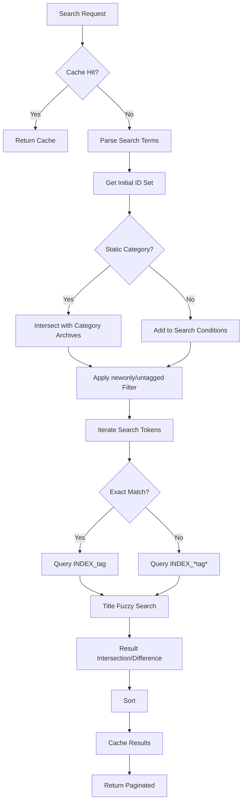
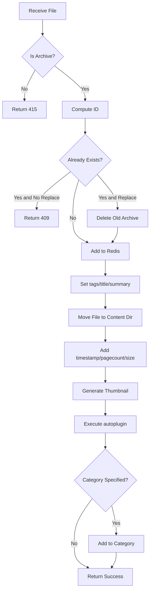
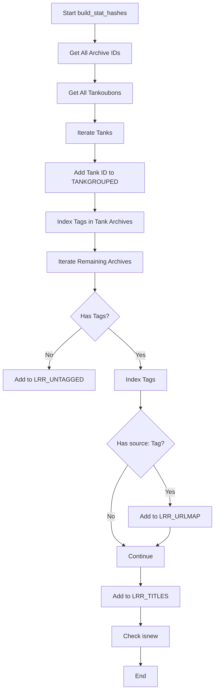

# Model Layer Deep Analysis

> Analysis Date: 2026-01-11

This document provides detailed analysis of the Model layer business logic.

---

## 📊 Module Overview

| Module | Lines | Main Function |
|--------|-------|---------------|
| `Reader.pm` | 86 | Image resizing, page list generation |
| `Upload.pm` | 268 | File upload handling, duplicate detection, auto-plugin execution |
| `Backup.pm` | 183 | Database backup/restore (JSON format) |
| `Opds.pm` | 161 | OPDS Catalog generation |
| `Search.pm` | 524 | **Core** Search engine |
| `Tankoubon.pm` | 527 | Collections (ordered archive sets) |
| `Stats.pm` | ~300 | Statistics calculation |
| `Category.pm` | ~350 | Category management |

---

## 🔍 Search.pm - Core Search Engine

### Core Functions

#### `do_search($filter, $category_id, $start, $sortkey, $sortorder, $newonly, $untaggedonly, $grouptanks)`

Main search entry point:

```perl
sub do_search {
    # 1. Check search cache
    my ($cachehit, @filtered) = check_cache($cachekey, $cachekey_inv);
    
    # 2. If cache miss, execute full search
    unless ($cachehit && $sortkey ne "lastread") {
        @filtered = search_uncached(...);
        $redis->hset("LRR_SEARCHCACHE", $cachekey, nfreeze \@filtered);
    }
    
    # 3. Return paginated results
    return ($total, $#filtered + 1, @filtered[$start..$end]);
}
```

### Search Syntax Parsing (`compute_search_filter`)

| Syntax | Meaning | Example |
|--------|---------|---------|
| `keyword` | Fuzzy match title/tags | `fate` |
| `"exact"` | Exact match | `"fate grand order"` |
| `-keyword` | Exclude | `-yaoi` |
| `namespace:value` | Namespace search | `artist:wada` |
| `pages:>20` | Page count filter | `pages:>=50` |
| `read:>0` | Read page count | `read:10` |
| `?` `_` | Single character wildcard | `fate_go` |
| `*` `%` | Multi-character wildcard | `fate*` |

### Search Flow



### Sort Optimization (Lua Script)

```perl
# Use Lua to batch fetch data, reduce network requests
my $script = <<'LUA';
local result = {}
for i=1,#ARGV do
    local id = ARGV[i]
    local value = redis.call('HGET', id, 'lastreadtime')
    result[i] = {id, value or "0"}
end
return cjson.encode(result)
LUA
```

---

## 📚 Tankoubon.pm - Collection System

### Concept

Tankoubon (単行本) is an ordered archive collection, similar to a "playlist".

### Redis Storage Structure

```
TANK_1589141306 (Sorted Set):
  score 0: "name_Collection Name"    # Metadata
  score -1: "summary_Description"
  score -2: "tags_Tags"
  score 1: "archive_id_1"           # Archives in order
  score 2: "archive_id_2"
  score 3: "archive_id_3"
```

### Core Functions

| Function | Purpose |
|----------|---------|
| `create_tankoubon($name, $tank_id)` | Create collection |
| `get_tankoubon($tank_id, $fulldata, $page)` | Get collection details |
| `add_to_tankoubon($tank_id, $arc_id)` | Add archive |
| `remove_from_tankoubon($tank_id, $arc_id)` | Remove archive (auto-reorder) |
| `update_archive_list($tank_id, $data)` | Batch update order |

### Tank Grouping (Search Aggregation)

When Tank Grouping is enabled:
- Archives in collection are hidden from main search
- Collection appears as a whole in search results
- Uses `LRR_TANKGROUPED` Redis Set for tracking

## 🔧 Reader.pm - Reader Model

### Core Functions

#### `resize_image($content, $quality, $threshold)`
On-demand image compression to save bandwidth:

```perl
sub resize_image ( $content, $quality, $threshold ) {
    # Only compress if file size exceeds threshold
    if ( ( length($content) / 1024 ) > $threshold ) {
        return $resampler->resize_page( $content, $quality, "jpg" );
    }
    return $content;
}
```

**Parameters:**
- `$content`: Image binary data
- `$quality`: JPEG quality (0-100)
- `$threshold`: File size threshold to trigger compression (KB)

#### `build_reader_JSON($self, $id, $force)`
Build reader page list:

```perl
sub build_reader_JSON ( $self, $id, $force ) {
    my $archive = get_archive_path( $redis, $id );
    my @images = get_filelist($archive, $id);
    
    foreach my $imgpath (@images) {
        # URI encoding
        $imgpath = uri_escape_utf8(redis_decode($imgpath));
        $imgpath =~ s!%2F!/!g;  # Preserve slashes
        
        # Build API URL
        push @images_browser, "/api/archives/$id/page?path=$imgpath";
    }
    
    # Update page count
    $redis->hset( $id, "pagecount", scalar @images );
    
    return { pages => \@images_browser };
}
```

**Return Format:**
```json
{
  "pages": [
    "/api/archives/{id}/page?path=001.jpg",
    "/api/archives/{id}/page?path=002.jpg"
  ]
}
```

---

## 📤 Upload.pm - Upload Processing Model

### Core Functions

#### `handle_incoming_file($tempfile, $catid, $tags, $title, $summary)`

Complete upload processing flow:



**Key Processing Steps:**

1. **File Validation**
```perl
unless ( is_archive($filename) ) {
    return ( 415, "deadbeef", $filename, "Unsupported File Extension" );
}
```

2. **ID Computation** (based on file content SHA1)
```perl
my $id = compute_id($tempfile);
```

3. **Duplicate Detection**
```perl
my $isdupe = $redis->exists($id) && -e get_archive_path($redis, $id);
if ( (-e $output_file || $isdupe) && !$replace_dupe ) {
    return ( 409, $id, $filename, "This file already exists" );
}
```

4. **Two-Phase File Move** (prevent Shinobu early detection)
```perl
move_path( $tempfile, $output_file . ".upload" );  # First move as .upload
rename_path( $output_file . ".upload", $output_file );  # Then rename to trigger update
```

5. **Source URL Indexing**
```perl
if ( $t =~ /source:(.*)/i ) {
    $redis_search->hset( "LRR_URLMAP", trim_url($url), $id );
}
```

#### `download_url($url, $ua)`

Remote file download:

```perl
sub download_url ( $url, $ua ) {
    my $tx = $ua->max_response_size(0)->max_redirects(5)->get($url);
    
    # Content-Disposition parsing
    if ( $content_disp =~ /filename="(.*)"/ ) {
        $filename = $1;
    } elsif ( $content_disp =~ /filename\*=UTF-8''(.*)/ ) {
        $filename = uri_unescape($1);  # RFC 5987
    }
    
    # Windows illegal character cleanup
    $filename =~ s@[\\/:\\"*?<>|]+@@g;
    
    # Filename length limit (CryptoFS: 143, Normal: 255)
    while ( get_bytelength($filename . $ext . ".upload") > $byte_limit ) {
        $filename = substr($filename, 0, -1);
    }
    
    $tx->result->save_to("$tempdir/$filename");
    return "$tempdir/$filename";
}
```

---

## 💾 Backup.pm - Backup/Restore Model

### Backup JSON Structure

```json
{
  "archives": [
    {
      "arcid": "abc123...",
      "title": "Comic Title",
      "tags": "artist:name, parody:series",
      "summary": "Description",
      "thumbhash": "def456...",
      "filename": "file.zip"
    }
  ],
  "categories": [
    {
      "catid": "SET_123456",
      "name": "Favorites",
      "search": "",
      "archives": ["abc123", "def456"]
    }
  ],
  "tankoubons": [
    {
      "tankid": "TANK_789012",
      "name": "Collection Name",
      "archives": ["abc123", "def456"]
    }
  ]
}
```

### `build_backup_JSON()`

```perl
# Backup categories
my @cats = $redis->keys('SET_??????????');
foreach my $key (@cats) {
    my %data = $redis->hgetall($key);
    push @{$backup{categories}}, {
        catid => $key,
        name => redis_decode($data{name}),
        archives => decode_json($data{archives})
    };
}

# Backup collections
my @tanks = LANraragi::Model::Tankoubon::get_tankoubon_list(-1);
foreach my $tank (@tanks) {
    push @{$backup{tankoubons}}, {...};
}

# Backup archive metadata
my @keys = $redis->keys('?' x 40);  # 40 chars = Archive ID
foreach my $id (@keys) {
    push @{$backup{archives}}, {
        arcid => $id,
        title => redis_decode($hash{title}),
        tags => redis_decode($hash{tags}),
        ...
    };
}
```

### `restore_from_JSON($json)`

Restore flow:
1. Call `clean_database()` to clean invalid entries
2. Restore Categories (create + add members)
3. Restore Tankoubons
4. Restore Archives metadata (only update existing)
5. Call `invalidate_cache()` to refresh cache

---

## 📚 Opds.pm - OPDS Protocol Support

### OPDS Output Structure

```xml
<feed xmlns="http://www.w3.org/2005/Atom">
  <title>{server_title}</title>
  <entry>
    <title>{archive_title}</title>
    <author><name>{artist}</name></author>
    <dc:language>{language}</dc:language>
    <updated>{lastreaddate}</updated>
    <link rel="http://opds-spec.org/acquisition" 
          type="{mimetype}" 
          href="/api/archives/{id}/download"/>
    <link rel="http://opds-spec.org/image" 
          type="image/jpeg" 
          href="/api/archives/{id}/thumbnail"/>
  </entry>
</feed>
```

### Key Functions

#### `get_opds_data($id)`
Generate OPDS entry from Archive metadata:

```perl
# Extract metadata from tags
$arcdata->{author}   = get_tag_with_namespace("artist", $tags);
$arcdata->{language} = get_tag_with_namespace("language", $tags);
$arcdata->{circle}   = get_tag_with_namespace("group", $tags);

# MIME type mapping
if ($file =~ /\.pdf$/)     { $arcdata->{mimetype} = "application/pdf"; }
elsif ($file =~ /\.(rar|cbr)$/) { $arcdata->{mimetype} = "application/x-cbr"; }
elsif ($file =~ /\.epub$/) { $arcdata->{mimetype} = "application/epub+zip"; }
else                       { $arcdata->{mimetype} = "application/x-cbz"; }
```

#### `render_archive_page($mojo, $id, $page)`
Serve single page image directly (for OPDS readers):

```perl
my @images = get_filelist($archive, $id);
my $image = $images[$page - 1];
LANraragi::Model::Archive::serve_page($mojo, $id, $image);
```

---

## 📂 Category.pm - Category Management Model

### Concept

Categories are divided into two types:
- **Static Category**: Manually added archive collection
- **Dynamic Category**: Auto-matched collection based on search criteria

### Redis Storage Structure

```
SET_1589141306 (Hash):
  name: "Category Name"
  search: ""              # Empty string = Static category
  pinned: "1"             # Is pinned
  archives: '["id1","id2"]'  # JSON array (static only)
```

### Core Functions

| Function | Purpose |
|----------|---------|
| `get_category_list()` | Get all categories |
| `get_static_category_list()` | Get static categories only |
| `get_categories_containing_archive($id)` | Find categories containing archive |
| `get_category($id)` | Get single category details |
| `create_category($name, $favtag, $pinned, $id)` | Create/update category |
| `delete_category($id)` | Delete category |
| `add_to_category($cat_id, $arc_id)` | Add archive to static category |
| `remove_from_category($cat_id, $arc_id)` | Remove archive from category |

### Bookmark Link Feature

```perl
# Link bookmark button to a static category
$redis->hset('LRR_CONFIG', 'bookmark_link', $cat_id);

# Get/remove bookmark link
get_bookmark_link();
update_bookmark_link($cat_id);
remove_bookmark_link();
```

---

## 📊 Stats.pm - Statistics and Index Building

### Core Function

`build_stat_hashes()` is the core function for rebuilding search indexes, building the following Redis structures:

| Redis Key | Type | Purpose |
|-----------|------|---------|
| `LRR_URLMAP` | Hash | URL → Archive ID mapping |
| `LRR_STATS` | Sorted Set | Tag cloud statistics (score = occurrence count) |
| `LRR_UNTAGGED` | Set | Untagged archive IDs |
| `LRR_NEW` | Set | New archive IDs (isnew=true) |
| `LRR_TITLES` | Sorted Set | Title index (`title\0id` format) |
| `LRR_TANKGROUPED` | Set | Visible IDs after collection grouping |
| `INDEX_{tag}` | Set | Archive ID index per tag |

### Index Building Flow



### Other Key Functions

| Function | Purpose |
|----------|---------|
| `get_archive_count()` | Get archive count (including Tank grouping) |
| `get_page_stat()` | Get total page statistics |
| `is_url_recorded($url)` | Check if URL is already in library |
| `build_tag_stats($minscore)` | Build tag cloud JSON |
| `compute_content_size()` | Calculate library total size (GB) |
