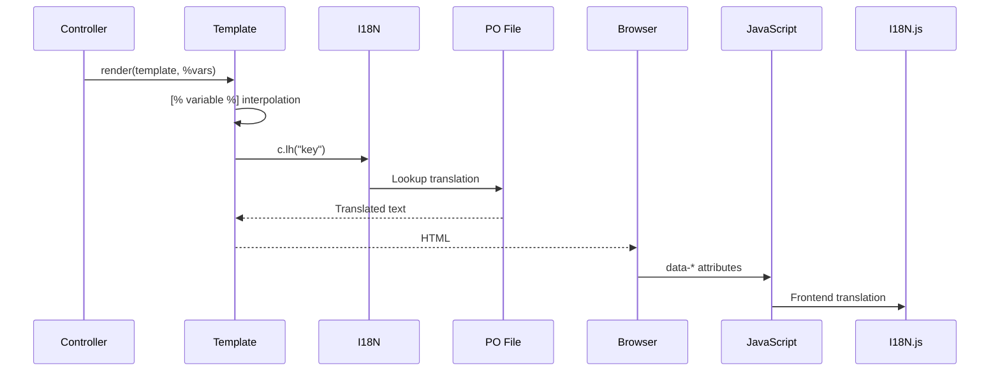

# Template and Internationalization System

> Analysis Date: 2026-01-11

This document analyzes LANraragi's Template Toolkit templating system and I18N internationalization implementation.

---

## 📊 Template File Overview (19 + 6 Sub-templates)

### Main Templates

| Template | Size | Main Function |
|----------|------|---------------|
| `index.html.tt2` | 12 KB | Index/Archive list |
| `reader.html.tt2` | 16 KB | Reader page |
| `config.html.tt2` | 6 KB | Settings page |
| `plugins.html.tt2` | 9 KB | Plugin management |
| `batch.html.tt2` | 9 KB | Batch operations |
| `category.html.tt2` | 7 KB | Category management |
| `duplicates.html.tt2` | 9 KB | Duplicate detection |
| `edit.html.tt2` | 6 KB | Metadata editing |
| `upload.html.tt2` | 5 KB | Upload page |
| `stats.html.tt2` | 5 KB | Statistics page |
| `backup.html.tt2` | 4 KB | Backup page |
| `logs.html.tt2` | 4 KB | Log viewer |
| `login.html.tt2` | 2 KB | Login page |
| `i18n.html.tt2` | 13 KB | Language selection (JS translations) |

### OPDS Templates

| Template | Size | Function |
|----------|------|----------|
| `opds.html.tt2` | 4 KB | OPDS catalog (Atom XML) |
| `opds_entry.html.tt2` | 2 KB | OPDS entry |

### Common Components

| Template | Function |
|----------|----------|
| `footer.html.tt2` | Footer |
| `exception.production.html.ep` | Production error page |
| `not_found.production.html.ep` | 404 page |

### Config Sub-templates (`templates/templates_config/`)

| Template | Function |
|----------|----------|
| `config_files.html.tt2` | File/folder settings |
| `config_global.html.tt2` | Global settings |
| `config_security.html.tt2` | Security settings |
| `config_shinobu.html.tt2` | Shinobu file watcher settings |
| `config_tags.html.tt2` | Tag rule settings |
| `config_theme.html.tt2` | Theme/appearance settings |

## 🔧 Template Syntax

### 1. Variable Interpolation
```html
<title>[% title %]</title>
<h1>[% motd %]</h1>
```

### 2. Conditionals
```html
[% IF userlogged %]
    <a href="/upload">Add Archives</a>
[% ELSE %]
    <a href="/login">Admin Login</a>
[% END %]
```

### 3. Loops
```html
[% FOREACH categories %]
    <option value="[% id %]">[% name %]</option>
[% END %]
```

### 4. Template Includes
```html
[% INCLUDE footer %]
[% INCLUDE config %]
```

### 5. Block Definition (BLOCK)
```html
[% BLOCK arrows %]
<div class="paginator">
    <a class="fa fa-angle-left page-link" value="left"></a>
    <a class="fa fa-angle-right page-link" value="right"></a>
</div>
[% END %]
```

### 6. URL Generation
```html
<link rel="stylesheet" href="[% c.url_for('/css/lrr.css?$version') %]" />
<a href="[% c.url_for('/reader').query(id => arcid) %]">Read</a>
```

---

## 🌐 Internationalization System

### Backend Implementation (`I18N.pm`)

Based on `Locale::Maketext` + PO files:

```perl
use Locale::Maketext::Lexicon {
    en => [ Gettext => "../../locales/template/en.po" ],
    zh => [ Gettext => "../../locales/template/zh.po" ],
    # ... more languages
    _auto => 0,  # Don't auto-generate missing translations
};
```

### Template Usage

```html
<a href="/upload">[% c.lh("Add Archives") %]</a>
<input value='[% c.lh("Apply Filter") %]' />
```

### Frontend I18N (`i18n.js`)

JavaScript side maintains separate translation object:

```javascript
const I18N = {
    ConfirmYes: "Yes",
    ConfirmDestructive: "Are you sure?",
    GenericReponseError: "Server error",
    // ...
};
```

### Supported Languages (14)

| Code | Language | File |
|------|----------|------|
| `en` | English | `en.po` |
| `zh` | Chinese (Simplified) | `zh.po` |
| `zh_Hant` | Chinese (Traditional) | `zh_Hant.po` |
| `ja` | Japanese | `ja.po` |
| `ko` | Korean | `ko.po` |
| `de` | German | `de.po` |
| `fr` | French | `fr.po` |
| `es` | Spanish | `es.po` |
| `it` | Italian | `it.po` |
| `pt` | Portuguese | `pt.po` |
| `id` | Indonesian | `id.po` |
| `vi` | Vietnamese | `vi.po` |
| `nb_NO` | Norwegian | `nb_NO.po` |
| `as` | Assamese | `as.po` |

---

## 📝 Template Variables

### Global Variables

| Variable | Source | Purpose |
|----------|--------|---------|
| `title` | Controller | Page title |
| `version` | Controller | Version number (Cache Busting) |
| `userlogged` | Session | Login state |
| `csshead` | Config | Custom CSS (theme) |
| `motd` | Config | Index message |

### Reader-specific Variables

| Variable | Purpose |
|----------|---------|
| `id` | Current Archive ID |
| `use_local` | Local progress mode |
| `auth_progress` | Authenticated progress mode |
| `categories` | Available category list |
| `arc_categories` | Current archive's categories |

### Index-specific Variables

| Variable | Purpose |
|----------|---------|
| `categories` | Category list |
| `usingdefpass` | Using default password warning |

---

## 🔄 Data Flow



---

## 📝 I18N Contribution Guide

### Translation Method: Weblate

Official translation hosting: https://hosted.weblate.org/projects/lanraragi/lanraragi-source/

### .po File Format

```
# Comment
msgid "Database Backup/Restore"
msgstr "数据库备份/恢复"
```

| Element | Description |
|---------|-------------|
| `msgid` | Original English text (must match exactly) |
| `msgstr` | Translated text |

### Placeholder Syntax

**In Templates (HTML):**
```html
[% c.lh("Version [_1] [_2]", version, vername) %]
```

**In .po files:**
```
msgid "Version %1 %2"
msgstr "版本 %1 %2"
```

**In JavaScript:**
```javascript
// i18n.html.tt2
I18N.BatchChangedTitle = (title) => `[% c.lh("Changed title to: \${title}") %]`;
```

```
msgid "Changed title to: \${title}"
msgstr "标题已更改为: ${title}"
```
> Note: `\` only in msgid, not in msgstr

### Special Cases

`~` is an escape character in Locale::Maketext:
```
msgid "namespace : strips the namespace from the tags"
msgstr "<b>~namespace</b> : strips the namespace from the tags"
```
