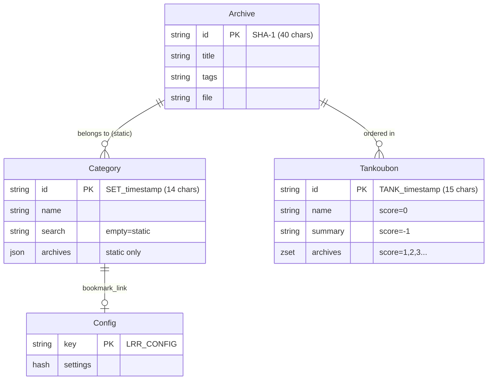

# 数据层：Redis 架构

> **分析文件**: `Redis.pm`, `Database.pm`, `Archive.pm`, `Category.pm`, `Tankoubon.pm`, `Config.pm`

---

## 📊 Redis 多数据库架构

本项目使用 **4 个 Redis 数据库**（逻辑分离）：

| 数据库编号 | 配置键 | 连接方法 | 用途 |
|-----------|--------|----------|------|
| 0 (默认) | `redis_database` | `get_redis()` | 档案元数据存储 |
| 1 | `redis_database_minion` | `get_minion()` | Minion 任务队列 |
| 2 | `redis_database_config` | `get_redis_config()` | 全局配置 + 文件映射 |
| 3 | `redis_database_search` | `get_redis_search()` | 搜索索引 + 缓存 |

---

## 🗂️ 完整架构定义

### 1. 档案 (Archive)

| 存储类型 | 键格式 | 数据库 |
|---------|--------|--------|
| Redis Hash | `{40字符SHA-1}` | DB 0 (Archive) |

**字段：**

| 字段 | 类型 | 描述 |
|------|------|------|
| `name` | string | 原始文件名 |
| `title` | string | 显示标题 |
| `tags` | string | 逗号分隔的标签 |
| `summary` | string | 描述 |
| `file` | string | 文件路径（未编码） |
| `arcsize` | int64 | 文件大小（字节） |
| `isnew` | string | "true" 或 "false" |
| `progress` | int | 阅读进度（页码） |
| `pagecount` | int | 总页数 |
| `lastreadtime` | int64 | 最后阅读时间（Unix 时间戳） |
| `thumbjob` | string | 缩略图任务 ID (Minion) |
| `thumbhash` | string | 首页图像的 SHA-1 哈希 |

---

### 2. 分类 (Category)

| 存储类型 | 键格式 | 数据库 |
|---------|--------|--------|
| Redis Hash | `SET_{timestamp}` (14 字符) | DB 0 (Archive) |

**两种类型：**
- **静态分类**：`search` 为空，`archives` 存储 JSON 数组
- **动态分类**：`search` 存储搜索查询，自动匹配档案

**字段：**

| 字段 | 类型 | 描述 |
|------|------|------|
| `name` | string | 分类名称 |
| `search` | string | 动态分类搜索查询（空 = 静态） |
| `pinned` | string | 是否置顶 |
| `archives` | JSON | 静态分类的档案 ID 列表 |

**关键实现细节：**
```perl
# Archives stored as JSON array
$redis->hset( $cat_id, "archives", encode_json( \@cat_archives ) );
```

---

### 3. 单行本 (Tankoubon/合集)

| 存储类型 | 键格式 | 数据库 |
|---------|--------|--------|
| Redis **Sorted Set** | `TANK_{timestamp}` (15 字符) | DB 0 (Archive) |

**使用 Sorted Set 实现有序列表：**

| 分数 | 成员 | 用途 |
|------|------|------|
| 0 | `name_{title}` | 合集名称 |
| -1 | `summary_{text}` | 合集简介 |
| -2 | `tags_{tags}` | 合集标签 |
| 1, 2, 3... | `{archive_id}` | 有序档案列表 |

**元数据存储机制：**
```perl
my %TANK_METADATA = ( "name" => 0, "summary" => -1, "tags" => -2 );
# Score 0/-1/-2 for metadata, positive integers for ordering
$redis->zadd( $tank_id, $score, $arc_id );  # Add archive
```

---

### 4. 配置 (Config/全局配置)

| 存储类型 | 键 | 数据库 |
|---------|-----|--------|
| Redis Hash | `LRR_CONFIG` | DB 2 (Config) |

**主要配置字段：**

| 字段 | 类型 | 描述 |
|------|------|------|
| `dirname` | string | 内容目录（默认 ./content） |
| `thumbdir` | string | 缩略图目录（默认 ./thumb） |
| `htmltitle` | string | 页面标题 |
| `motd` | string | 欢迎消息 |
| `theme` | string | 主题 CSS |
| `pagesize` | int | 页面大小（默认 100） |
| `password` | string | bcrypt 密码哈希 |
| `enablepass` | bool | 启用密码保护 |
| `apikey` | string | API 密钥 |
| `enablecors` | bool | 启用 CORS |
| `devmode` | bool | 开发模式 |
| `enableresize` | bool | 启用图像缩放 |
| `usedateadded` | bool | 添加日期标签 |
| `enablecryptofs` | bool | 加密文件系统 |
| `tagruleson` | bool | 启用标签规则 |
| `localprogress` | bool | 本地进度 |
| `authprogress` | bool | 认证后保存进度 |
| `sizethreshold` | int | 缩放阈值 |
| `readerquality` | int | 阅读器质量 |
| `hqthumbpages` | bool | 高质量缩略图 |
| `jxlthumbpages` | bool | JXL 格式缩略图 |
| `replacedupe` | bool | 替换重复项 |
| `replacetitles` | bool | 替换标题 |
| `tagrules` | string | 标签过滤规则 |
| `bookmark_link` | string | 书签分类 ID |

---

## 🔍 搜索索引结构 (DB 3)

| 键 | 类型 | 用途 |
|----|------|------|
| `LRR_TITLES` | Sorted Set | 标题索引（成员：`{title}\0{id}`） |
| `INDEX_{tag}` | Set | 标签索引（成员：档案 ID） |
| `LRR_NEW` | Set | 未读档案 ID |
| `LRR_UNTAGGED` | Set | 未标记档案 ID |
| `LRR_TANKGROUPED` | Set | 可搜索项目（单个档案或合集） |
| `LRR_URLMAP` | Hash | URL → 档案 ID 映射 |
| `LRR_SEARCHCACHE` | Hash | 搜索缓存 |
| `LRR_STATS` | Sorted Set | 统计/标签云数据 |

---

## 🔧 配置数据库结构 (DB 2)

| 键 | 类型 | 用途 |
|----|------|------|
| `LRR_CONFIG` | Hash | 全局配置设置 |
| `LRR_FILEMAP` | Hash | 文件路径 → 档案 ID 映射 (Shinobu) |
| `LRR_TAGRULES` | List | 计算后的标签过滤规则 |
| `LRR_TOTALPAGESTAT` | String | 总阅读页数计数器 |
| `LRR_DUPLICATE_GROUPS` | Hash | 重复档案组数据 |
| `LRR_PLUGIN_{namespace}` | Hash | 各插件设置存储 |

---

## 🔗 实体关系图



---

## ⚠️ 重要说明

### 1. 分类与单行本的区别

| 特性 | 分类 | 单行本 |
|------|------|--------|
| 存储类型 | Hash + JSON | Sorted Set |
| 排序 | 无序 | 有序（分数） |
| 类型 | 静态/动态 | 仅静态 |
| 搜索可见性 | 无影响 | 吸收档案 |

### 2. 单行本搜索可见性逻辑

```perl
# When adding to collection, hide individual archive from search
$redis_search->srem( "LRR_TANKGROUPED", $arc_id );
$redis_search->sadd( "LRR_TANKGROUPED", $tank_id );
```

### 3. 环境变量覆盖

| 变量 | 描述 |
|------|------|
| `LRR_DATA_DIRECTORY` | 内容文件夹覆盖 |
| `LRR_THUMB_DIRECTORY` | 缩略图文件夹覆盖 |
| `LRR_TEMP_DIRECTORY` | 临时文件夹覆盖 |
| `LRR_LOG_DIRECTORY` | 日志文件夹覆盖 |
| `LRR_FORCE_DEBUG` | 强制启用调试模式 |
| `LRR_NETWORK` | 网络接口绑定 |
| `LRR_REDIS_ADDRESS` | Redis 地址覆盖（优先于 lrr.conf） |

---

## 🔑 档案 ID 计算

档案 ID 的计算方式：
1. 读取归档文件的**前 512KB**
2. 计算该数据的 **SHA-1 哈希**

> **注意**：这意味着两个前 512KB 相同的归档将拥有相同的 ID，即使后续内容不同。

---

## 🔍 搜索缓存键格式

搜索结果缓存在 `LRR_SEARCHCACHE` 中，使用复合键：

```
{columnfilter}-{filter}-{sortkey}-{sortorder}-{newonly}
```

示例：`--title-asc-0`（无过滤器，按标题升序排列，非仅限新内容）

缓存将在以下情况下失效：
- 编辑档案元数据
- 添加/删除档案

---

## ✅ 总结

| 实体 | 存储类型 | 键格式 | 数据库 |
|------|----------|--------|--------|
| 档案 | Hash | 40 字符 SHA-1 | DB 0 |
| 分类 | Hash | `SET_` + 10 位时间戳 | DB 0 |
| 单行本 | Sorted Set | `TANK_` + 10 位时间戳 | DB 0 |
| 配置 | Hash | `LRR_CONFIG` | DB 2 |
| 文件映射 | Hash | `LRR_FILEMAP` | DB 2 |
| 插件设置 | Hash | `LRR_PLUGIN_{namespace}` | DB 2 |
| 搜索索引 | Set/ZSet/Hash | 多种 | DB 3 |
