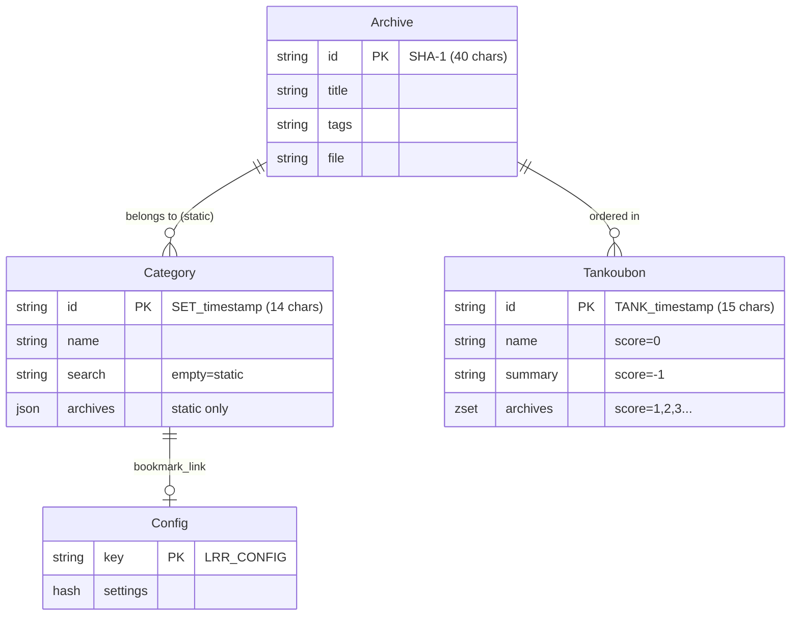

# Phase 1: 完整 Redis Schema 分析报告

> **分析文件**: `Redis.pm`, `Database.pm`, `Archive.pm`, `Category.pm`, `Tankoubon.pm`, `Config.pm`  
> **分析日期**: 2026-01-11 | **状态**: ✅ Phase 1 完成

---

## 📊 Redis 多数据库架构

项目使用 **4 个 Redis 数据库**（逻辑分离）：

| DB 编号 | 配置键 | 连接方法 | 用途 |
|---------|--------|----------|------|
| 0 (默认) | `redis_database` | `get_redis()` | Archive 元数据存储 |
| 1 | `redis_database_minion` | `get_minion()` | Minion 任务队列 |
| 2 | `redis_database_config` | `get_redis_config()` | 全局配置 + 文件映射 |
| 3 | `redis_database_search` | `get_redis_search()` | 搜索索引 + 缓存 |

```go
// Go 连接管理器提案
type RedisManager struct {
    Archive *redis.Client  // DB 0
    Minion  *redis.Client  // DB 1  
    Config  *redis.Client  // DB 2
    Search  *redis.Client  // DB 3
}
```

---

## 🗂️ 完整 Schema 定义

### 1. Archive (档案)

| 存储 | Key 格式 | 数据库 |
|------|----------|--------|
| Redis Hash | `{40-char-sha1}` | DB 0 (Archive) |

```go
type Archive struct {
    ID           string `redis:"-"`            // Key: SHA-1(前512KB)
    Name         string `redis:"name"`         // 文件名
    Title        string `redis:"title"`        // 显示标题
    Tags         string `redis:"tags"`         // 逗号分隔标签
    Summary      string `redis:"summary"`      // 描述
    File         string `redis:"file"`         // 文件路径 (不编码)
    ArcSize      int64  `redis:"arcsize"`      // 文件大小
    IsNew        string `redis:"isnew"`        // "true"/"false"
    Progress     int    `redis:"progress"`     // 阅读进度
    PageCount    int    `redis:"pagecount"`    // 总页数
    LastReadTime int64  `redis:"lastreadtime"` // Unix时间戳
    ThumbJob     string `redis:"thumbjob"`     // 缩略图任务ID (Minion)
    ThumbHash    string `redis:"thumbhash"`    // 首页图片SHA-1哈希
}
```

---

### 2. Category (分类)

| 存储 | Key 格式 | 数据库 |
|------|----------|--------|
| Redis Hash | `SET_{timestamp}` (14字符) | DB 0 (Archive) |

**两种类型:**
- **静态分类**: `search` 为空，`archives` 存 JSON 数组
- **动态分类**: `search` 存搜索条件，按条件自动匹配

```go
type Category struct {
    ID       string   `json:"id"`       // Key: SET_1704931200
    Name     string   `json:"name"`     // 分类名
    Search   string   `json:"search"`   // 动态分类的搜索条件 (空=静态)
    Pinned   string   `json:"pinned"`   // 是否置顶
    Archives []string `json:"archives"` // 静态分类的 Archive ID 列表 (JSON)
}
```

**关键实现细节:**
```perl
# Archives 存储为 JSON 数组
$redis->hset( $cat_id, "archives", encode_json( \@cat_archives ) );
```

---

### 3. Tankoubon (合集/单行本)

| 存储 | Key 格式 | 数据库 |
|------|----------|--------|
| Redis **Sorted Set** | `TANK_{timestamp}` (15字符) | DB 0 (Archive) |

**使用 Sorted Set 实现有序列表:**

| Score | Member | 用途 |
|-------|--------|------|
| 0 | `name_{title}` | 合集名称 |
| -1 | `summary_{text}` | 合集简介 |
| -2 | `tags_{tags}` | 合集标签 |
| 1, 2, 3... | `{archive_id}` | 有序的 Archive 列表 |

```go
type Tankoubon struct {
    ID       string   `json:"id"`       // Key: TANK_1704931200
    Name     string   `json:"name"`     // 合集名
    Summary  string   `json:"summary"`  // 简介
    Tags     string   `json:"tags"`     // 标签
    Archives []string `json:"archives"` // 有序 Archive ID 列表
}
```

**元数据存储机制:**
```perl
my %TANK_METADATA = ( "name" => 0, "summary" => -1, "tags" => -2 );
# Score 0/-1/-2 用于元数据，正整数用于排序
$redis->zadd( $tank_id, $score, $arc_id );  # 添加 archive
```

---

### 4. Config (全局配置)

| 存储 | Key | 数据库 |
|------|-----|--------|
| Redis Hash | `LRR_CONFIG` | DB 2 (Config) |

```go
type AppConfig struct {
    // 目录配置
    Dirname     string `redis:"dirname"`     // 内容目录 (默认 ./content)
    Thumbdir    string `redis:"thumbdir"`    // 缩略图目录 (默认 ./thumb)
    
    // 显示设置
    HTMLTitle   string `redis:"htmltitle"`   // 页面标题
    MOTD        string `redis:"motd"`        // 欢迎消息
    Theme       string `redis:"theme"`       // 主题CSS
    PageSize    int    `redis:"pagesize"`    // 分页大小 (默认 100)
    
    // 安全设置
    Password    string `redis:"password"`    // bcrypt 密码哈希
    EnablePass  bool   `redis:"enablepass"`  // 启用密码保护
    APIKey      string `redis:"apikey"`      // API 密钥
    EnableCORS  bool   `redis:"enablecors"`  // 启用 CORS
    
    // 功能开关
    DevMode        bool `redis:"devmode"`        // 开发模式
    EnableResize   bool `redis:"enableresize"`   // 启用图片缩放
    EnableDateAdd  bool `redis:"usedateadded"`   // 添加日期标签
    EnableCryptoFS bool `redis:"enablecryptofs"` // 加密文件系统
    TagRulesOn     bool `redis:"tagruleson"`     // 启用标签规则
    
    // 阅读设置
    LocalProgress  bool `redis:"localprogress"`  // 本地进度
    AuthProgress   bool `redis:"authprogress"`   // 认证后保存进度
    SizeThreshold  int  `redis:"sizethreshold"`  // 缩放阈值
    ReaderQuality  int  `redis:"readerquality"`  // 阅读器质量
    
    // 缩略图设置
    HQThumbPages   bool `redis:"hqthumbpages"`   // 高质量缩略图
    JXLThumbPages  bool `redis:"jxlthumbpages"`  // JXL格式缩略图
    ReplaceDupe    bool `redis:"replacedupe"`    // 替换重复
    ReplaceTitles  bool `redis:"replacetitles"`  // 替换标题
    
    // 特殊配置
    TagRules      string `redis:"tagrules"`      // 标签过滤规则
    BookmarkLink  string `redis:"bookmark_link"` // 书签关联的分类ID
}
```

---

## 🔍 搜索索引结构 (DB 3)

| Key | 类型 | 用途 |
|-----|------|------|
| `LRR_TITLES` | Sorted Set | 标题索引 (member: `{title}\0{id}`) |
| `INDEX_{tag}` | Set | 标签索引 (members: archive IDs) |
| `LRR_NEW` | Set | 未读档案 ID |
| `LRR_UNTAGGED` | Set | 未标记档案 ID |
| `LRR_TANKGROUPED` | Set | 可搜索项 (单独档案或合集) |
| `LRR_URLMAP` | Hash | URL → Archive ID 映射 |
| `LRR_SEARCHCACHE` | Hash | 搜索缓存 |
| `LRR_STATS` | Sorted Set | 统计/标签云数据 |

---

## 🔧 配置数据库结构 (DB 2)

| Key | 类型 | 用途 |
|-----|------|------|
| `LRR_CONFIG` | Hash | 全局配置设置 |
| `LRR_FILEMAP` | Hash | 文件路径 → Archive ID 映射 (Shinobu) |
| `LRR_TAGRULES` | List | 计算后的标签过滤规则 |
| `LRR_TOTALPAGESTAT` | String | 已读总页数计数器 |
| `LRR_DUPLICATE_GROUPS` | Hash | 重复档案组数据 |
| `LRR_PLUGIN_{namespace}` | Hash | 插件设置存储 |

---

## 🔗 实体关系图



---

## ⚠️ Go 迁移注意事项

### 1. Category vs Tankoubon 的区别

| 特性 | Category | Tankoubon |
|------|----------|-----------|
| 存储类型 | Hash + JSON | Sorted Set |
| 排序 | 无序 | 有序 (score) |
| 类型 | 静态/动态 | 仅静态 |
| 搜索可见性 | 不影响 | 吸收档案 |

### 2. Tankoubon 的搜索可见性逻辑

```perl
# 添加到合集时，从搜索中隐藏单独档案
$redis_search->srem( "LRR_TANKGROUPED", $arc_id );
$redis_search->sadd( "LRR_TANKGROUPED", $tank_id );
```

### 3. 环境变量覆盖

```go
// 部分配置可被环境变量覆盖
os.Getenv("LRR_DATA_DIRECTORY")   // 覆盖 dirname
os.Getenv("LRR_THUMB_DIRECTORY")  // 覆盖 thumbdir
os.Getenv("LRR_REDIS_ADDRESS")    // 覆盖 redis_address
os.Getenv("LRR_FORCE_DEBUG")      // 强制开发模式
```

---

## 📋 Go Struct 完整定义

```go
package model

// ========== 核心实体 ==========

type Archive struct {
    ID           string   `json:"arcid" redis:"-"`
    Title        string   `json:"title" redis:"title"`
    Filename     string   `json:"filename" redis:"name"`
    Tags         string   `json:"tags" redis:"tags"`
    Summary      string   `json:"summary" redis:"summary"`
    FilePath     string   `json:"-" redis:"file"`
    Extension    string   `json:"extension"`
    IsNew        bool     `json:"isnew"`
    Progress     int      `json:"progress" redis:"progress"`
    PageCount    int      `json:"pagecount" redis:"pagecount"`
    LastReadTime int64    `json:"lastreadtime" redis:"lastreadtime"`
    Size         int64    `json:"size" redis:"arcsize"`
}

type Category struct {
    ID       string   `json:"id"`
    Name     string   `json:"name"`
    Search   string   `json:"search"`   // 空=静态, 非空=动态
    Pinned   string   `json:"pinned"`
    Archives []string `json:"archives"` // 仅静态分类
}

type Tankoubon struct {
    ID       string   `json:"id"`
    Name     string   `json:"name"`
    Summary  string   `json:"summary"`
    Tags     string   `json:"tags"`
    Archives []string `json:"archives"` // 有序列表
}

// ========== Redis Key 常量 ==========

const (
    KeyConfig       = "LRR_CONFIG"
    KeyTitles       = "LRR_TITLES"
    KeyNew          = "LRR_NEW"
    KeyUntagged     = "LRR_UNTAGGED"
    KeyTankGrouped  = "LRR_TANKGROUPED"
    KeyURLMap       = "LRR_URLMAP"
    KeySearchCache  = "LRR_SEARCHCACHE"
    KeyFileMap      = "LRR_FILEMAP"
    KeyTagRules     = "LRR_TAGRULES"
    
    PrefixTagIndex  = "INDEX_"
    PrefixCategory  = "SET_"
    PrefixTankoubon = "TANK_"
)
```

---

## 🌍 环境变量 (官方)

可以使用以下变量覆盖默认行为：

| 变量 | 说明 |
|------|------|
| `LRR_DATA_DIRECTORY` | 内容文件夹覆盖 |
| `LRR_THUMB_DIRECTORY` | 缩略图文件夹覆盖 |
| `LRR_TEMP_DIRECTORY` | 临时文件夹覆盖 |
| `LRR_LOG_DIRECTORY` | 日志文件夹覆盖 |
| `LRR_FORCE_DEBUG` | 强制启用调试模式 |
| `LRR_NETWORK` | 网络接口绑定 |
| `LRR_REDIS_ADDRESS` | Redis 地址覆盖 (优先于 lrr.conf) |

---

## 🔑 Archive ID 计算方式 (官方)

Archive ID 的计算方法：
1. 读取档案文件的**前 512KB**
2. 对这些数据计算 **SHA-1 哈希**

```perl
# 来自 LANraragi::Utils::Database
# Archive ID = 前 512KB 的 SHA-1
```

> **注意**: 这意味着两个前 512KB 相同的档案会有相同的 ID，即使后续内容不同。

---

## 🔍 搜索缓存 Key 格式 (官方)

搜索结果缓存在 `LRR_SEARCHCACHE` 中，使用组合键：

```
{columnfilter}-{filter}-{sortkey}-{sortorder}-{newonly}
```

示例: `--title-asc-0` (无过滤、按标题升序、非仅新档案)

缓存失效条件：
- 编辑档案元数据时
- 添加/删除档案时

---

## ✅ Phase 1 总结

| 实体 | 存储类型 | Key 格式 | 数据库 |
|------|----------|----------|--------|
| Archive | Hash | 40字符 SHA-1 | DB 0 |
| Category | Hash | `SET_` + 10位时间戳 | DB 0 |
| Tankoubon | Sorted Set | `TANK_` + 10位时间戳 | DB 0 |
| Config | Hash | `LRR_CONFIG` | DB 2 |
| 文件映射 | Hash | `LRR_FILEMAP` | DB 2 |
| 插件设置 | Hash | `LRR_PLUGIN_{namespace}` | DB 2 |
| 搜索索引 | Set/ZSet/Hash | 多种 | DB 3 |

**Phase 1 数据层分析完成！** 已准备好进入 Phase 2: API 层分析。

