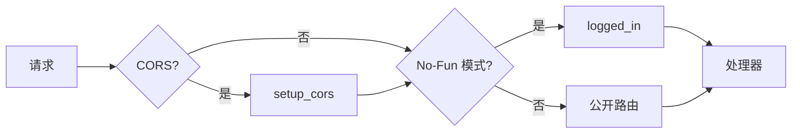

# API 层架构

> **分析文件**: `Routing.pm`, `Api/Archive.pm`, `Api/Search.pm`

---

## 📊 路由架构概述

### 中间件链



### 路由类型

| 类型 | 权限 | 用途 |
|------|------|------|
| `public_routes` | 无需认证 | 首页、阅读器、登录 |
| `public_api` | 无需认证 | 公开 API（可被 No-Fun 锁定） |
| `logged_in` | 需要认证 | 管理页面 |
| `logged_in_api` | 需要认证 | 管理 API |

---

## 🔗 完整 API 端点列表

### Archive API (`/api/archives`)

| 方法 | 路径 | 认证 | 处理器 | 描述 |
|------|------|------|--------|------|
| GET | `/api/archives` | ❌ | `serve_archivelist` | 获取所有存档列表 |
| GET | `/api/archives/untagged` | ❌ | `serve_untagged_archivelist` | 获取未打标签的存档 |
| GET | `/api/archives/:id` | ❌ | `serve_metadata` | [已弃用] 获取元数据 |
| GET | `/api/archives/:id/metadata` | ❌ | `serve_metadata` | 获取存档元数据 |
| GET | `/api/archives/:id/thumbnail` | ❌ | `serve_thumbnail` | 获取缩略图 |
| GET | `/api/archives/:id/download` | ❌ | `serve_file` | 下载原始文件 |
| GET | `/api/archives/:id/page` | ❌ | `serve_page` | 获取指定页面 |
| GET | `/api/archives/:id/files` | ❌ | `get_file_list` | 获取文件列表 |
| GET | `/api/archives/:id/categories` | ❌ | `get_categories` | 获取所属分类 |
| GET | `/api/archives/:id/tankoubons` | ❌ | `get_tankoubons_file` | 获取所属合集 |
| PUT | `/api/archives/upload` | ✅ | `create_archive` | 上传新存档 |
| PUT | `/api/archives/:id/metadata` | ✅ | `update_metadata` | 更新元数据 |
| PUT | `/api/archives/:id/thumbnail` | ✅ | `update_thumbnail` | 更新缩略图 |
| PUT | `/api/archives/:id/progress/:page` | ⚙️ | `update_progress` | 更新阅读进度 |
| POST | `/api/archives/:id/files/thumbnails` | ❌ | `generate_page_thumbnails` | 生成页面缩略图 |
| DELETE | `/api/archives/:id` | ✅ | `delete_archive` | 删除存档 |
| DELETE | `/api/archives/:id/isnew` | ❌ | `clear_new` | 清除新标记 |

> ⚙️ = 可配置 (`enable_authprogress`)

---

### Search API (`/api/search`)

| 方法 | 路径 | 认证 | 处理器 | 描述 |
|------|------|------|--------|------|
| GET | `/search` | ❌ | `handle_datatables` | DataTables 格式（内部） |
| GET | `/api/search` | ❌ | `handle_api` | 公开搜索 API |
| GET | `/api/search/random` | ❌ | `get_random_archives` | 获取随机存档 |
| DELETE | `/api/search/cache` | ✅ | `clear_cache` | 清除搜索缓存 |

#### 搜索 API 参数

| 参数 | 类型 | 默认值 | 描述 |
|------|------|--------|------|
| `filter` | string | - | 搜索关键词（见下方语法） |
| `category` | string | "" | 分类 ID |
| `start` | int | 0 | 分页偏移。**使用 `-1` 获取完整未分页结果**（自 0.8.2） |
| `sortby` | string | "title" | 排序字段：`title` 或 `lastread`（如果启用服务器端进度） |
| `order` | string | "asc" | 排序方向 (asc/desc) |
| `newonly` | bool | false | 仅新存档 |
| `untaggedonly` | bool | false | 仅未打标签 |
| `groupby_tanks` | bool | false | 按合集分组 |

#### 搜索查询语法

| 语法 | 描述 | 示例 |
|------|------|------|
| `keyword` | 模糊匹配标题/标签 | `fate` |
| `"..."` | 精确字符串搜索 | `"fate grand order"` |
| `?` 或 `_` | 单字符通配符 | `fate_go` |
| `*` 或 `%` | 多字符通配符 | `fate*` |
| `-keyword` | 排除词 | `-yaoi` |
| `$` 后缀 | 精确标签匹配（忽略 misc） | `artist:rco$` |
| `namespace:value` | 命名空间搜索 | `artist:wada` |
| `pages:>N` | 页数过滤 | `pages:>=50` |
| `read:>N` | 阅读进度过滤 | `read:10` |

#### 搜索响应代码

| 代码 | 描述 |
|------|------|
| `200` | 成功返回结果 |
| `204` | 搜索引擎未初始化（等待几秒） |

---

### Category API (`/api/categories`)

| 方法 | 路径 | 认证 | 处理器 |
|------|------|------|--------|
| GET | `/api/categories` | ❌ | `get_category_list` |
| GET | `/api/categories/:id` | ❌ | `get_category` |
| GET | `/api/categories/bookmark_link` | ❌ | `get_bookmark_link` |
| PUT | `/api/categories` | ✅ | `create_category` |
| PUT | `/api/categories/:id` | ✅ | `update_category` |
| PUT | `/api/categories/:id/:archive` | ✅ | `add_to_category` |
| PUT | `/api/categories/bookmark_link/:id` | ✅ | `update_bookmark_link` |
| DELETE | `/api/categories/:id` | ✅ | `delete_category` |
| DELETE | `/api/categories/:id/:archive` | ✅ | `remove_from_category` |
| DELETE | `/api/categories/bookmark_link` | ✅ | `remove_bookmark_link` |

---

### Tankoubon API (`/api/tankoubons`)

| 方法 | 路径 | 认证 | 处理器 |
|------|------|------|--------|
| GET | `/api/tankoubons` | ❌ | `get_tankoubon_list` |
| GET | `/api/tankoubons/:id` | ❌ | `get_tankoubon` |
| PUT | `/api/tankoubons` | ✅ | `create_tankoubon` |
| PUT | `/api/tankoubons/:id` | ✅ | `update_tankoubon` |
| PUT | `/api/tankoubons/:id/:archive` | ✅ | `add_to_tankoubon` |
| DELETE | `/api/tankoubons/:id` | ✅ | `delete_tankoubon` |
| DELETE | `/api/tankoubons/:id/:archive` | ✅ | `remove_from_tankoubon` |

---

### Database API (`/api/database`)

| 方法 | 路径 | 认证 | 处理器 |
|------|------|------|--------|
| GET | `/api/database/backup` | ✅ | `serve_backup` |
| GET | `/api/database/stats` | ❌ | `serve_tag_stats` |
| DELETE | `/api/database/isnew` | ✅ | `clear_new_all` |
| POST | `/api/database/drop` | ✅ | `drop_database` |
| POST | `/api/database/clean` | ✅ | `clean_database` |

---

### 其他 API

#### Shinobu API (`/api/shinobu`)
| 方法 | 路径 | 认证 | 处理器 |
|------|------|------|--------|
| GET | `/api/shinobu` | ✅ | `shinobu_status` |
| POST | `/api/shinobu/stop` | ✅ | `stop_shinobu` |
| POST | `/api/shinobu/restart` | ✅ | `restart_shinobu` |
| POST | `/api/shinobu/rescan` | ✅ | `reset_filemap` |

#### Minion API (`/api/minion`)
| 方法 | 路径 | 认证 | 处理器 |
|------|------|------|--------|
| GET | `/api/minion/:jobid` | ❌ | `minion_job_status` |
| GET | `/api/minion/:jobid/detail` | ✅ | `minion_job_detail` |
| POST | `/api/minion/:jobname/queue` | ✅ | `queue_minion_job` |

#### OPDS API (`/api/opds`)
| 方法 | 路径 | 认证 | 处理器 |
|------|------|------|--------|
| GET | `/api/opds` | ❌ | `serve_opds_catalog` |
| GET | `/api/opds/:id` | ❌ | `serve_opds_item` |
| GET | `/api/opds/:id/pse` | ❌ | `serve_opds_page` |

#### 杂项 API
| 方法 | 路径 | 认证 | 处理器 |
|------|------|------|--------|
| GET | `/api/info` | ❌ | `serve_serverinfo` |
| GET | `/api/plugins/:type` | ✅ | `list_plugins` |
| POST | `/api/plugins/use` | ✅ | `use_plugin_sync` |
| POST | `/api/plugins/queue` | ✅ | `use_plugin_async` |
| POST | `/api/download_url` | ✅ | `download_url` |
| POST | `/api/regen_thumbs` | ✅ | `regen_thumbnails` |
| DELETE | `/api/tempfolder` | ✅ | `clean_tempfolder` |

---

## 🔐 认证模式

### 1. 密码保护（Session）
```perl
$public_routes->post('/login')->to('login#check');
$logged_in = $public_routes->under('/')->to('login#logged_in');
```

### 2. API 密钥
```perl
# 在 login#logged_in_api 中检查
# 头部格式: "Bearer " + base64(api_key)
Authorization: Bearer {base64_encoded_api_key}

# 替代方式: 查询参数（未文档化，主要用于 OPDS）
?key={api_key}
```

### 3. No-Fun 模式
强制所有公开路由需要认证：
```perl
if ( $self->LRR_CONF->enable_nofun ) {
    $public_routes = $logged_in;
    $public_api = $logged_in_api;
}
```

---

## 📝 响应格式

### 成功响应
```json
{
    "operation": "update_metadata",
    "success": 1,
    "message": "Updated metadata for \"Title\"!"
}
```

### 错误响应
```json
{
    "operation": "update_metadata",
    "success": 0,
    "error": "No archive ID specified."
}
```

### 列表响应
```json
{
    "recordsTotal": 100,
    "recordsFiltered": 25,
    "data": [...]
}
```

---

## 🔒 并发锁机制

使用 `exec_with_lock` 防止并发写入：

```perl
exec_with_lock( $self, $redis, "archive-write:$id", "operation", $id, sub {
    # 临界区代码
});
```

**锁类型：**
- `upload:{filename}` - 上传锁
- `archive-write:{id}` - 存档修改锁

---

## 🔍 搜索引擎深度分析

### 搜索流程


### 缓存机制

```perl
# 缓存键格式
$cachekey = "$category_id-$filter-$sortkey-$sortorder-$newonly-$untaggedonly-$grouptanks"

# 序列化: Storable (nfreeze/thaw)
$redis->hset( "LRR_SEARCHCACHE", $cachekey, nfreeze \@filtered );
```

**缓存失效：**
- 调用 `invalidate_cache()` 删除 `LRR_SEARCHCACHE`
- `lastread` 排序不使用缓存

### 索引使用

| 排序/过滤 | 使用的索引 |
|-----------|-----------|
| 标题搜索 | `LRR_TITLES` (Sorted Set ZSCAN) |
| 标签搜索 | `INDEX_{tag}` (Set SMEMBERS) |
| 新存档 | `LRR_NEW` (Set) |
| 未打标签 | `LRR_UNTAGGED` (Set) |
| 合集分组 | `LRR_TANKGROUPED` (Set) |

---

## ✅ 总结

| 发现 | 详情 |
|------|------|
| **总端点数** | 60+ (API + 页面) |
| **认证模式** | Session + API Key + No-Fun |
| **响应格式** | JSON，带 operation/success |
| **并发控制** | Redis 分布式锁 |
| **特殊功能** | OPDS, WebSocket (批量) |
