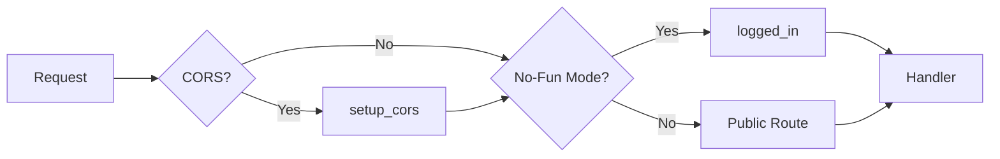
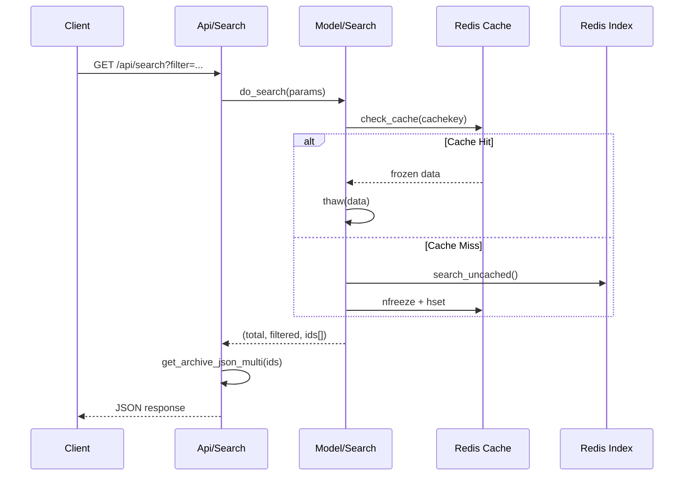

# Phase 2: API 层架构分析报告

> **分析文件**: `Routing.pm`, `Api/Archive.pm`, `Api/Search.pm`  
> **分析日期**: 2026-01-11

---

## 📊 路由架构概览

### 中间件链



### 路由类型

| 类型 | 权限 | 用途 |
|------|------|------|
| `public_routes` | 无需认证 | 首页、阅读器、登录 |
| `public_api` | 无需认证 | 公开 API (可被 No-Fun 锁定) |
| `logged_in` | 需要认证 | 管理页面 |
| `logged_in_api` | 需要认证 | 管理 API |

---

## 🔗 完整 API 端点列表

### Archive API (`/api/archives`)

| Method | Path | Auth | Handler | 描述 |
|--------|------|------|---------|------|
| GET | `/api/archives` | ❌ | `serve_archivelist` | 获取所有档案列表 |
| GET | `/api/archives/untagged` | ❌ | `serve_untagged_archivelist` | 获取未标记档案 |
| GET | `/api/archives/:id` | ❌ | `serve_metadata` | [废弃] 获取元数据 |
| GET | `/api/archives/:id/metadata` | ❌ | `serve_metadata` | 获取档案元数据 |
| GET | `/api/archives/:id/thumbnail` | ❌ | `serve_thumbnail` | 获取缩略图 |
| GET | `/api/archives/:id/download` | ❌ | `serve_file` | 下载原文件 |
| GET | `/api/archives/:id/page` | ❌ | `serve_page` | 获取指定页面 |
| GET | `/api/archives/:id/files` | ❌ | `get_file_list` | 获取文件列表 |
| GET | `/api/archives/:id/categories` | ❌ | `get_categories` | 获取所属分类 |
| GET | `/api/archives/:id/tankoubons` | ❌ | `get_tankoubons_file` | 获取所属合集 |
| PUT | `/api/archives/upload` | ✅ | `create_archive` | 上传新档案 |
| PUT | `/api/archives/:id/metadata` | ✅ | `update_metadata` | 更新元数据 |
| PUT | `/api/archives/:id/thumbnail` | ✅ | `update_thumbnail` | 更新缩略图 |
| PUT | `/api/archives/:id/progress/:page` | ⚙️ | `update_progress` | 更新阅读进度 |
| POST | `/api/archives/:id/files/thumbnails` | ❌ | `generate_page_thumbnails` | 生成页面缩略图 |
| DELETE | `/api/archives/:id` | ✅ | `delete_archive` | 删除档案 |
| DELETE | `/api/archives/:id/isnew` | ❌ | `clear_new` | 清除新标记 |

> ⚙️ = 可配置 (`enable_authprogress`)

---

### Search API (`/api/search`)

| Method | Path | Auth | Handler | 描述 |
|--------|------|------|---------|------|
| GET | `/search` | ❌ | `handle_datatables` | DataTables 格式 (内部) |
| GET | `/api/search` | ❌ | `handle_api` | 公共搜索 API |
| GET | `/api/search/random` | ❌ | `get_random_archives` | 随机获取 |
| DELETE | `/api/search/cache` | ✅ | `clear_cache` | 清除搜索缓存 |

#### Search API 参数

| 参数 | 类型 | 默认值 | 说明 |
|------|------|--------|------|
| `filter` | string | - | 搜索关键词 (见下方语法) |
| `category` | string | "" | 分类 ID |
| `start` | int | 0 | 分页偏移。**使用 `-1` 获取完整未分页结果** (0.8.2+) |
| `sortby` | string | "title" | 排序字段: `title` 或 `lastread` (需启用服务器端进度追踪) |
| `order` | string | "asc" | 排序方向 (asc/desc) |
| `newonly` | bool | false | 仅新档案 |
| `untaggedonly` | bool | false | 仅未标记 |
| `groupby_tanks` | bool | false | 按合集分组 |

#### 搜索查询语法 (官方)

| 语法 | 说明 | 示例 |
|------|------|------|
| `keyword` | 模糊匹配标题/标签 | `fate` |
| `"..."` | 精确字符串搜索 | `"fate grand order"` |
| `?` 或 `_` | 单字符通配符 | `fate_go` |
| `*` 或 `%` | 多字符通配符 | `fate*` |
| `-keyword` | 排除词 | `-yaoi` |
| `$` 后缀 | 精确标签匹配 (忽略 misc) | `artist:rco$` |
| `namespace:value` | 命名空间搜索 | `artist:wada` |
| `pages:>N` | 页数过滤 | `pages:>=50` |
| `read:>N` | 阅读进度过滤 | `read:10` |

#### 搜索响应码

| 状态码 | 说明 |
|--------|------|
| `200` | 成功返回结果 |
| `204` | 搜索引擎尚未初始化 (等待几秒) |

#### 随机搜索参数 (`/api/search/random`)

| 参数 | 类型 | 默认值 | 说明 |
|------|------|--------|------|
| `filter` | string | - | 搜索关键词 |
| `category` | string | "" | 分类 ID |
| `newonly` | bool | false | 仅新档案 |
| `untaggedonly` | bool | false | 仅未标记 |
| `groupby_tanks` | bool | false | 按合集分组 |
| `count` | int | 5 | 返回的随机档案数量 |

---

### Category API (`/api/categories`)

| Method | Path | Auth | Handler |
|--------|------|------|---------|
| GET | `/api/categories` | ❌ | `get_category_list` |
| GET | `/api/categories/:id` | ❌ | `get_category` |
| GET | `/api/categories/bookmark_link` | ❌ | `get_bookmark_link` |
| PUT | `/api/categories` | ✅ | `create_category` |
| PUT | `/api/categories/:id` | ✅ | `update_category` |
| PUT | `/api/categories/:id/:archive` | ✅ | `add_to_category` |
| PUT | `/api/categories/bookmark_link/:id` | ✅ | `update_bookmark_link` |
| DELETE | `/api/categories/:id` | ✅ | `delete_category` |
| DELETE | `/api/categories/:id/:archive` | ✅ | `remove_from_category` |
| DELETE | `/api/categories/bookmark_link` | ✅ | `remove_bookmark_link` |

---

### Tankoubon API (`/api/tankoubons`)

| Method | Path | Auth | Handler |
|--------|------|------|---------|
| GET | `/api/tankoubons` | ❌ | `get_tankoubon_list` |
| GET | `/api/tankoubons/:id` | ❌ | `get_tankoubon` |
| PUT | `/api/tankoubons` | ✅ | `create_tankoubon` |
| PUT | `/api/tankoubons/:id` | ✅ | `update_tankoubon` |
| PUT | `/api/tankoubons/:id/:archive` | ✅ | `add_to_tankoubon` |
| DELETE | `/api/tankoubons/:id` | ✅ | `delete_tankoubon` |
| DELETE | `/api/tankoubons/:id/:archive` | ✅ | `remove_from_tankoubon` |

---

### Database API (`/api/database`)

| Method | Path | Auth | Handler |
|--------|------|------|---------|
| GET | `/api/database/backup` | ✅ | `serve_backup` |
| GET | `/api/database/stats` | ❌ | `serve_tag_stats` |
| DELETE | `/api/database/isnew` | ✅ | `clear_new_all` |
| POST | `/api/database/drop` | ✅ | `drop_database` |
| POST | `/api/database/clean` | ✅ | `clean_database` |

---

### Other APIs

#### Shinobu API (`/api/shinobu`)
| Method | Path | Auth | Handler |
|--------|------|------|---------|
| GET | `/api/shinobu` | ✅ | `shinobu_status` |
| POST | `/api/shinobu/stop` | ✅ | `stop_shinobu` |
| POST | `/api/shinobu/restart` | ✅ | `restart_shinobu` |
| POST | `/api/shinobu/rescan` | ✅ | `reset_filemap` |

#### Minion API (`/api/minion`)
| Method | Path | Auth | Handler |
|--------|------|------|---------|
| GET | `/api/minion/:jobid` | ❌ | `minion_job_status` |
| GET | `/api/minion/:jobid/detail` | ✅ | `minion_job_detail` |
| POST | `/api/minion/:jobname/queue` | ✅ | `queue_minion_job` |

#### OPDS API (`/api/opds`)
| Method | Path | Auth | Handler |
|--------|------|------|---------|
| GET | `/api/opds` | ❌ | `serve_opds_catalog` |
| GET | `/api/opds/:id` | ❌ | `serve_opds_item` |
| GET | `/api/opds/:id/pse` | ❌ | `serve_opds_page` |

#### Misc API
| Method | Path | Auth | Handler |
|--------|------|------|---------|
| GET | `/api/info` | ❌ | `serve_serverinfo` |
| GET | `/api/plugins/:type` | ✅ | `list_plugins` |
| POST | `/api/plugins/use` | ✅ | `use_plugin_sync` |
| POST | `/api/plugins/queue` | ✅ | `use_plugin_async` |
| POST | `/api/download_url` | ✅ | `download_url` |
| POST | `/api/regen_thumbs` | ✅ | `regen_thumbnails` |
| DELETE | `/api/tempfolder` | ✅ | `clean_tempfolder` |

---

## 🔐 认证模式

### 1. 密码保护 (Session)
```perl
$public_routes->post('/login')->to('login#check');
$logged_in = $public_routes->under('/')->to('login#logged_in');
```

### 2. API Key
```perl
# 在 login#logged_in_api 中检查
# 请求头格式: "Bearer " + base64(api_key)
Authorization: Bearer {base64_encoded_api_key}

# 备用: 查询参数 (未文档化，主要用于 OPDS)
?key={api_key}
```

### 3. No-Fun Mode
强制所有公共路由需要认证：
```perl
if ( $self->LRR_CONF->enable_nofun ) {
    $public_routes = $logged_in;
    $public_api = $logged_in_api;
}
```

---

## 📝 响应格式

### 成功响应
```json
{
    "operation": "update_metadata",
    "success": 1,
    "message": "Updated metadata for \"Title\"!"
}
```

### 错误响应
```json
{
    "operation": "update_metadata",
    "success": 0,
    "error": "No archive ID specified."
}
```

### 列表响应
```json
{
    "recordsTotal": 100,
    "recordsFiltered": 25,
    "data": [...]
}
```

---

## 🔒 并发锁机制

使用 `exec_with_lock` 防止并发写入：

```perl
exec_with_lock( $self, $redis, "archive-write:$id", "operation", $id, sub {
    # 临界区代码
});
```

**锁类型:**
- `upload:{filename}` - 上传锁
- `archive-write:{id}` - 档案修改锁

---

## 🏗️ Go Router 设计提案

```go
package router

import (
    "github.com/gin-gonic/gin"
)

func SetupRouter(cfg *config.Config) *gin.Engine {
    r := gin.New()
    
    // 中间件
    r.Use(gin.Logger(), gin.Recovery())
    if cfg.EnableCORS {
        r.Use(CORSMiddleware())
    }
    
    // 公共路由
    public := r.Group("/api")
    {
        // Archive
        public.GET("/archives", archiveHandler.List)
        public.GET("/archives/:id/metadata", archiveHandler.GetMetadata)
        public.GET("/archives/:id/thumbnail", archiveHandler.GetThumbnail)
        public.GET("/archives/:id/download", archiveHandler.Download)
        
        // Search
        public.GET("/search", searchHandler.Search)
        public.GET("/search/random", searchHandler.Random)
        
        // Category & Tankoubon
        public.GET("/categories", categoryHandler.List)
        public.GET("/tankoubons", tankoubonHandler.List)
    }
    
    // 认证路由
    authed := r.Group("/api")
    authed.Use(AuthMiddleware(cfg))
    {
        authed.PUT("/archives/upload", archiveHandler.Upload)
        authed.PUT("/archives/:id/metadata", archiveHandler.UpdateMetadata)
        authed.DELETE("/archives/:id", archiveHandler.Delete)
        // ...
    }
    
    return r
}

// Go Handler 接口提案
type ArchiveHandler interface {
    List(c *gin.Context)
    GetMetadata(c *gin.Context)
    GetThumbnail(c *gin.Context)
    Download(c *gin.Context)
    Upload(c *gin.Context)
    UpdateMetadata(c *gin.Context)
    Delete(c *gin.Context)
}
```

---

## ✅ Phase 2 初步分析总结

| 发现项 | 详情 |
|--------|------|
| **总端点数** | 60+ (API + 页面) |
| **认证模式** | Session + API Key + No-Fun |
| **响应格式** | JSON with operation/success |
| **并发控制** | Redis 分布式锁 |
| **特殊功能** | OPDS, WebSocket (batch) |

---

## 🔍 搜索引擎深度分析

### 搜索流程



### 搜索语法解析

| 语法 | 示例 | 说明 |
|------|------|------|
| 普通搜索 | `artist:name` | 模糊匹配 |
| 精确搜索 | `"artist:name"` 或 `artist:name$` | 精确匹配 |
| 排除标签 | `-tag:value` | 排除结果 |
| 通配符 | `?` `_` (单字符), `*` `%` (多字符) | |
| 页数搜索 | `pages:>20`, `pages:<=30` | 页数范围 |
| 已读搜索 | `read:>0` | 阅读进度 |

### 缓存机制

```perl
# 缓存 Key 格式
$cachekey = "$category_id-$filter-$sortkey-$sortorder-$newonly-$untaggedonly-$grouptanks"

# 序列化方式: Storable (nfreeze/thaw)
$redis->hset( "LRR_SEARCHCACHE", $cachekey, nfreeze \@filtered );
```

**缓存失效:**
- 调用 `invalidate_cache()` 删除 `LRR_SEARCHCACHE`
- `lastread` 排序不使用缓存

### 排序优化 (Lua 脚本)

```lua
-- 批量获取 lastreadtime
local result = {}
for i=1,#ARGV do
    local id = ARGV[i]
    local value = redis.call('HGET', id, 'lastreadtime')
    result[i] = {id, value or "0"}
end
return cjson.encode(result)
```

**Go 实现建议:**
```go
// 使用 Redis Pipeline 替代 Lua
pipe := rdb.Pipeline()
for _, id := range ids {
    pipe.HGet(ctx, id, "lastreadtime")
}
results, _ := pipe.Exec(ctx)
```

### 索引利用

| 排序/过滤 | 使用的索引 |
|-----------|-----------|
| 标题搜索 | `LRR_TITLES` (Sorted Set ZSCAN) |
| 标签搜索 | `INDEX_{tag}` (Set SMEMBERS) |
| 新档案 | `LRR_NEW` (Set) |
| 未标记 | `LRR_UNTAGGED` (Set) |
| 合集分组 | `LRR_TANKGROUPED` (Set) |

---

## 🏗️ Go 搜索引擎设计提案

```go
package search

type SearchParams struct {
    Filter       string
    CategoryID   string
    Start        int
    SortKey      string
    SortOrder    bool // true = desc
    NewOnly      bool
    UntaggedOnly bool
    GroupTanks   bool
}

type SearchResult struct {
    Total    int               `json:"recordsTotal"`
    Filtered int               `json:"recordsFiltered"`
    Data     []model.Archive   `json:"data"`
}

type SearchEngine interface {
    Search(ctx context.Context, params SearchParams) (*SearchResult, error)
    InvalidateCache(ctx context.Context) error
}

// Token 表示一个搜索词
type Token struct {
    Tag     string
    IsNeg   bool // 排除
    IsExact bool // 精确匹配
}

func ParseFilter(filter string) []Token {
    // 实现搜索语法解析
}
```
