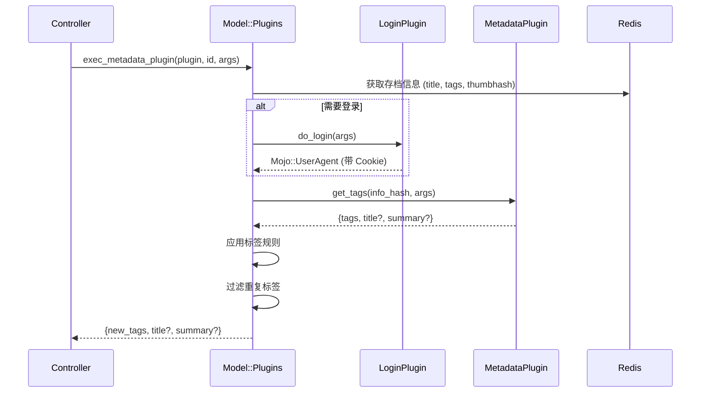

# 插件系统架构

> **分析文件**: `Utils/Plugins.pm`, `Model/Plugins.pm`, `Plugin/Metadata/EHentai.pm`

---

## 🔌 插件系统概述

### 插件发现机制

使用 `Module::Pluggable` 自动发现插件：
```perl
use Module::Pluggable require => 1, search_path => ['LANraragi::Plugin'];
```

---

## 📋 插件类型定义

| 类型 | 必需方法 | 用途 | 数量 |
|------|----------|------|------|
| `metadata` | `get_tags` | 获取存档元数据 | 22 |
| `login` | `do_login` | 网站认证 | 4 |
| `download` | `provide_url` | 下载外部资源 | 3 |
| `script` | `run_script` | 通用脚本执行 | 3 |

---

## 📝 plugin_info 契约

每个插件必须实现 `plugin_info()` 返回元数据：

```perl
sub plugin_info {
    return (
        name        => "E-Hentai",           # 显示名称
        type        => "metadata",           # 插件类型
        namespace   => "ehplugin",           # 唯一标识符
        author      => "Difegue",            # 作者
        version     => "2.6",                # 版本号
        description => "Searches...",        # HTML 描述
        icon        => "data:image/png;...", # Base64 图标
        
        # 可选字段
        login_from  => "ehlogin",            # 依赖的登录插件
        cooldown    => 4,                    # 冷却时间（秒）
        url_regex   => "e-hentai\\.org",     # 下载插件 URL 匹配
        oneshot_arg => "E-H Gallery URL",    # 一次性执行参数描述
        
        # 参数定义（数组或 Hash）
        parameters  => [
            { type => "string", desc => "Language" },
            { type => "bool",   desc => "Use thumbnails" },
        ],
    );
}
```

---

## 🔧 插件执行流程

### Login 插件

必需方法：`do_login`

| 输入 | 描述 |
|------|------|
| `$params` | 用户定义的插件参数 |

| 输出 | 描述 |
|------|------|
| `Mojo::UserAgent` | 配置好的 UA 对象（带 Cookie） |

```perl
sub do_login {
    shift;
    my ($params) = @_;
    my $ua = Mojo::UserAgent->new;
    $ua->cookie_jar->add(...);  # 添加登录 Cookie
    return $ua;
}
```

### Download 插件

必需方法：`provide_url`
必需元数据：`url_regex`

| 输入 (`$lrr_info`) | 描述 |
|--------------------|------|
| `url` | 要下载的 URL |
| `user_agent` | 预配置的 Mojo::UserAgent |
| `tempdir` | 本地文件组装的临时目录 |

| 输出 | 描述 |
|------|------|
| `download_url => "..."` | 直接下载 URL |
| `file_path => "..."` | 本地文件路径（已下载） |

```perl
sub provide_url {
    shift;
    my $lrr_info = shift;
    my $url = $lrr_info->{url};
    # ... 处理 URL ...
    return ( download_url => "https://direct.link/file.zip" );
    # 或
    return ( file_path => "/path/to/local/file.zip" );
}
```

### Script 插件

必需方法：`run_script`

| 输入 (`$lrr_info`) | 描述 |
|--------------------|------|
| `oneshot_param` | 用户运行时参数 |
| `user_agent` | 预配置的 Mojo::UserAgent |

| 输出 | 描述 |
|------|------|
| 任意 Hash | 直接返回给调用者 |
| `error => "..."` | 错误信息 |

```perl
sub run_script {
    shift;
    my ($lrr_info, $params) = @_;
    # ... 执行操作 ...
    return ( total => $count, ids => \@list );
}
```

### Metadata 插件



### $lrr_info 字段

| 字段 | 描述 |
|------|------|
| `archive_id` | 存档内部 ID（40字符 SHA1） |
| `archive_title` | 用户输入的存档标题 |
| `existing_tags` | LRR 中该存档已有的标签 |
| `thumbnail_hash` | 存档第一张图片的 SHA-1 哈希 |
| `file_path` | 存档的文件系统路径 |
| `oneshot_param` | 用户设置的一次性参数值 |
| `user_agent` | 用于网络请求的 Mojo::UserAgent 对象（如果依赖登录插件，会预配置 Cookie） |

---

## 💾 插件配置存储

### Redis 键格式

```
LRR_PLUGIN_{NAMESPACE}  (Hash)
├── enabled: "1" | "0"
├── param1: "value1"
├── param2: "value2"
└── customargs: "[...]"  (旧格式，JSON 数组)
```

### 参数迁移（旧 → 新）

```perl
# 旧格式：位置参数（JSON 数组）
customargs => '["value1", "value2"]'

# 新格式：命名参数（Hash 字段）
param_name => "value"
```

### to_named_params 字段 (v0.9.3+)

当将插件从位置参数转换为命名参数时，添加 `to_named_params` 以保留现有用户配置：

```perl
# 添加到 plugin_info 以自动转换旧配置
to_named_params => ['doomsday', 'iterations'],  # 旧参数顺序
parameters => {
    'iterations' => {type => "int",  desc => "Number of iterations"},
    'doomsday'   => {type => "bool", desc => "Enable DOOMSDAY"},
    'salvation'  => {type => "bool", desc => "New param (not in migration)"}
}
```

> **注意**：`to_named_params` 只在转换后首次加载时需要。可以在后续版本中删除。

---

## 🧪 EHentai 插件分析（代表性示例）

### 插件功能

1. **source 标签优先**：如果存在则使用现有的 `source:e-hentai.org/g/...`
2. **缩略图反向搜索**：使用 SHA-1 哈希搜索
3. **gID 标题搜索**：从标题中提取 `[1234567]`
4. **标题文本搜索**：后备方法

### 搜索策略

```perl
# 优先级: oneshot_param > source 标签 > 缩略图搜索 > gID 搜索 > 标题搜索
if ( $lrr_info->{oneshot_param} =~ /g\/(\d+)\/([0-z]+)/ ) { ... }
elsif ( $lrr_info->{existing_tags} =~ /source:.*e-hentai.org\/g\/(\d+)\/([0-z]+)/ ) { ... }
else { lookup_gallery(...) }
```

### 速率限制

```perl
cooldown => 4  # 4 秒冷却

# 检测 EH 速率限制警告
if ( index( $dom->to_string, "You are opening" ) != -1 ) {
    my $rand = 15 + int( rand( 51 - 15 ) );  # 15-50 秒随机等待
    sleep($rand);
}
```

---

## 📝 插件代码示例

### 日志记录
```perl
use LANraragi::Utils::Logging qw(get_plugin_logger);
my $logger = get_plugin_logger();

$logger->debug("只在调试模式显示");
$logger->info("普通日志");
$logger->warn("警告");
$logger->error("错误");
```

### HTTP 请求
```perl
my $ua = $lrr_info->{user_agent};

# GET 请求
$ua->get("http://example.com")->result->body;

# POST JSON 请求
my $rep = $ua->post(
    "https://api.example.com" => json => { key => "value" }
)->result;
my $json = $rep->json;  # 解码后的 Hash
```

### 读取 Redis 值
```perl
my $redis = LANraragi::Model::Config->get_redis;
my $value = $redis->get("key");
```

### 从压缩包提取文件
```perl
use LANraragi::Utils::Archive qw(is_file_in_archive extract_file_from_archive);

my $info_path = is_file_in_archive($file, "info.json");
if ($info_path) {
    my $filepath = extract_file_from_archive($file, $info_path);
    # 使用提取的文件...
    unlink $filepath;  # 完成后删除
}
```

---

## ✅ 总结

| 发现 | 详情 |
|------|------|
| **插件发现** | Module::Pluggable 自动扫描 |
| **4 种类型** | metadata, login, download, script |
| **配置存储** | Redis Hash (`LRR_PLUGIN_{NS}`) |
| **登录依赖** | `login_from` 字段指定 |
| **速率限制** | `cooldown` 字段 + 动态等待 |
| **参数迁移** | 位置 → 命名参数 |
