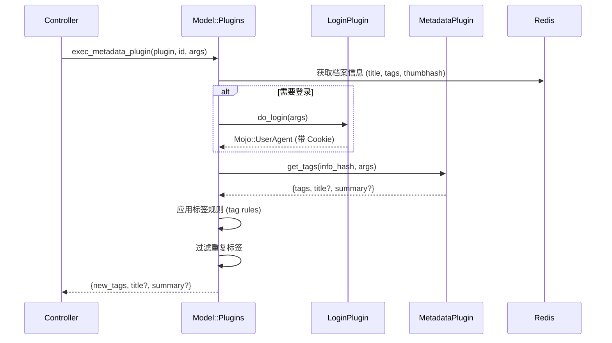

# Phase 4: 插件系统架构分析报告

> **分析文件**: `Utils/Plugins.pm`, `Model/Plugins.pm`, `Plugin/Metadata/EHentai.pm`  
> **分析日期**: 2026-01-11

---

## 🔌 插件系统概览

### 插件发现机制

使用 `Module::Pluggable` 自动发现插件：
```perl
use Module::Pluggable require => 1, search_path => ['LANraragi::Plugin'];
```

**Go 替代方案:**
1. 编译时注册 (推荐): 插件在 `init()` 中调用注册函数
2. 反射扫描: 使用 `reflect` 包扫描实现接口的类型
3. 插件目录: 扫描 `plugins/` 目录加载 `.so` 文件

---

## 📋 插件类型定义

| 类型 | 必须方法 | 用途 | 数量 |
|------|----------|------|------|
| `metadata` | `get_tags` | 获取档案元数据 | 21 |
| `login` | `do_login` | 网站登录认证 | 4 |
| `download` | `provide_url` | 下载外部资源 | 3 |
| `script` | `run_script` | 通用脚本执行 | 3 |

---

## 📝 plugin_info 合约

每个插件必须实现 `plugin_info()` 返回元数据：

```perl
sub plugin_info {
    return (
        name        => "E-Hentai",           # 显示名称
        type        => "metadata",           # 插件类型
        namespace   => "ehplugin",           # 唯一标识符
        author      => "Difegue",            # 作者
        version     => "2.6",                # 版本号
        description => "Searches...",        # HTML 描述
        icon        => "data:image/png;...", # Base64 图标
        
        # 可选字段
        login_from  => "ehlogin",            # 依赖的登录插件
        cooldown    => 4,                    # 冷却时间（秒）
        url_regex   => "e-hentai\\.org",     # 下载插件的 URL 匹配
        oneshot_arg => "E-H Gallery URL",    # 单次执行参数描述
        
        # 参数定义 (数组或 Hash)
        parameters  => [
            { type => "string", desc => "Language" },
            { type => "bool",   desc => "Use thumbnails" },
        ],
    );
}
```

### Go 结构体定义

```go
type PluginInfo struct {
    Name        string       `json:"name"`
    Type        PluginType   `json:"type"`
    Namespace   string       `json:"namespace"`
    Author      string       `json:"author"`
    Version     string       `json:"version"`
    Description string       `json:"description"`
    Icon        string       `json:"icon"`
    
    // 可选
    LoginFrom   string       `json:"login_from,omitempty"`
    Cooldown    int          `json:"cooldown,omitempty"`
    URLRegex    string       `json:"url_regex,omitempty"`
    OneshotArg  string       `json:"oneshot_arg,omitempty"`
    Parameters  []Parameter  `json:"parameters,omitempty"`
}

type PluginType string

const (
    PluginTypeMetadata PluginType = "metadata"
    PluginTypeLogin    PluginType = "login"
    PluginTypeDownload PluginType = "download"
    PluginTypeScript   PluginType = "script"
)

type Parameter struct {
    Type         string `json:"type"`  // "string", "bool", "int"
    Desc         string `json:"desc"`
    DefaultValue any    `json:"default_value,omitempty"`
}
```

---

## 🔧 插件执行流程

### Login 插件 (官方)

必需方法: `do_login`

| 输入 | 说明 |
|------|------|
| `$params` | 用户定义的插件参数 |

| 输出 | 说明 |
|------|------|
| `Mojo::UserAgent` | 配置好 cookies 的 UA 对象 |

```perl
sub do_login {
    shift;
    my ($params) = @_;
    my $ua = Mojo::UserAgent->new;
    $ua->cookie_jar->add(...);  # 添加登录 cookies
    return $ua;
}
```

### Download 插件 (官方)

必需方法: `provide_url`
必需元数据: `url_regex`

| 输入 (`$lrr_info`) | 说明 |
|--------------------|------|
| `url` | 要下载的 URL |
| `user_agent` | 预配置的 Mojo::UserAgent |
| `tempdir` | 用于本地文件组装的临时目录 |

| 输出 | 说明 |
|------|------|
| `download_url => "..."` | 直接下载 URL |
| `file_path => "..."` | 本地文件路径 (已下载) |

```perl
sub provide_url {
    shift;
    my $lrr_info = shift;
    my $url = $lrr_info->{url};
    # ... 处理 URL ...
    return ( download_url => "https://direct.link/file.zip" );
    # 或
    return ( file_path => "/path/to/local/file.zip" );
}
```

### Script 插件 (官方)

必需方法: `run_script`

| 输入 (`$lrr_info`) | 说明 |
|--------------------|------|
| `oneshot_param` | 用户的运行时参数 |
| `user_agent` | 预配置的 Mojo::UserAgent |

| 输出 | 说明 |
|------|------|
| 任意哈希 | 直接返回给调用者 |
| `error => "..."` | 错误消息 |

```perl
sub run_script {
    shift;
    my ($lrr_info, $params) = @_;
    # ... 执行操作 ...
    return ( total => $count, ids => \@list );
}
```

### Metadata 插件



### info_hash 传递给插件的信息

```go
type PluginContext struct {
    ArchiveID     string              `json:"archive_id"`
    ArchiveTitle  string              `json:"archive_title"`
    ExistingTags  string              `json:"existing_tags"`
    ThumbnailHash string              `json:"thumbnail_hash"`
    FilePath      string              `json:"file_path"`
    UserAgent     *http.Client        `json:"user_agent"`
    OneshotParam  string              `json:"oneshot_param"`
}
```

### $lrr_info 字段说明 (官方文档)

| 字段 | 说明 |
|------|------|
| `archive_id` | 档案内部 ID (40位 SHA1) |
| `archive_title` | 用户输入的档案标题 |
| `existing_tags` | 该档案已有的标签 |
| `thumbnail_hash` | 档案首图的 SHA-1 哈希 |
| `file_path` | 档案的文件系统路径 |
| `oneshot_param` | 用户设置的单次参数值 |
| `user_agent` | Mojo::UserAgent 对象用于网络请求 (如依赖 Login 插件则已配置 cookies) |

---

## 💾 插件配置存储

### Redis Key 格式

```
LRR_PLUGIN_{NAMESPACE}  (Hash)
├── enabled: "1" | "0"
├── param1: "value1"
├── param2: "value2"
└── customargs: "[...]"  (旧格式, JSON 数组)
```

### 参数迁移 (旧 → 新)

```perl
# 旧格式: 位置参数 (JSON 数组)
customargs => '["value1", "value2"]'

# 新格式: 命名参数 (Hash 字段)
param_name => "value"
```

### to_named_params 字段 (v0.9.3+)

将插件从位置参数转换为命名参数时，添加 `to_named_params` 可保留用户现有配置：

```perl
# 添加到 plugin_info 以自动转换旧配置
to_named_params => ['doomsday', 'iterations'],  # 旧参数顺序
parameters => {
    'iterations' => {type => "int",  desc => "迭代次数"},
    'doomsday'   => {type => "bool", desc => "启用末日模式"},
    'salvation'  => {type => "bool", desc => "新参数 (不在迁移中)"}
}
```

> **注意**: `to_named_params` 仅在转换后首次加载时需要，后续版本可移除。

---

## 🧪 EHentai 插件分析 (代表性示例)

### 插件功能

1. **source 标签优先**: 已有 `source:e-hentai.org/g/...` 则直接使用
2. **缩略图反向搜索**: 使用 SHA-1 hash 搜索
3. **gID 标题搜索**: 从标题提取 `[1234567]`
4. **标题文本搜索**: 兜底方案

### 搜索策略

```perl
# 优先级: oneshot_param > source标签 > 缩略图搜索 > gID搜索 > 标题搜索
if ( $lrr_info->{oneshot_param} =~ /g\/(\d+)\/([0-z]+)/ ) { ... }
elsif ( $lrr_info->{existing_tags} =~ /source:.*e-hentai.org\/g\/(\d+)\/([0-z]+)/ ) { ... }
else { lookup_gallery(...) }
```

### 速率限制

```perl
cooldown => 4  # 4 秒冷却时间

# 检测 EH 限流警告
if ( index( $dom->to_string, "You are opening" ) != -1 ) {
    my $rand = 15 + int( rand( 51 - 15 ) );  # 15-50 秒随机等待
    sleep($rand);
}
```

---

## 🏗️ Go 插件系统设计

### 方案对比

| 方案 | 优点 | 缺点 |
|------|------|------|
| **Go Interface** | 类型安全，性能最好 | 需重新编译 |
| **Go Plugin (.so)** | 动态加载 | 仅 Linux，版本敏感 |
| **Yaegi (Go 解释器)** | 热加载，类型安全 | 性能损失 |
| **Lua (gopher-lua)** | 轻量，沙箱 | 学习曲线 |
| **JavaScript (goja)** | 生态丰富 | 性能损失 |

### 推荐: Go Interface + 注册模式

```go
package plugin

// 插件注册表
var registry = make(map[string]Plugin)

func Register(p Plugin) {
    info := p.Info()
    registry[info.Namespace] = p
}

func Get(namespace string) (Plugin, bool) {
    p, ok := registry[namespace]
    return p, ok
}

// 核心接口
type Plugin interface {
    Info() PluginInfo
}

type MetadataPlugin interface {
    Plugin
    GetTags(ctx context.Context, info *PluginContext, params map[string]any) (*MetadataResult, error)
}

type LoginPlugin interface {
    Plugin
    DoLogin(ctx context.Context, params map[string]any) (*http.Client, error)
}

type DownloadPlugin interface {
    Plugin
    ProvideURL(ctx context.Context, info *DownloadContext, params map[string]any) (*DownloadResult, error)
}

type ScriptPlugin interface {
    Plugin
    RunScript(ctx context.Context, info *ScriptContext, params map[string]any) (map[string]any, error)
}
```

### 插件示例 (EHentai)

```go
package ehentai

import (
    "context"
    "regexp"
    "github.com/lanraragi/plugin"
)

func init() {
    plugin.Register(&EHentaiPlugin{})
}

type EHentaiPlugin struct{}

func (p *EHentaiPlugin) Info() plugin.PluginInfo {
    return plugin.PluginInfo{
        Name:       "E-Hentai",
        Type:       plugin.PluginTypeMetadata,
        Namespace:  "ehplugin",
        Author:     "Difegue",
        Version:    "2.6",
        LoginFrom:  "ehlogin",
        Cooldown:   4,
        Parameters: []plugin.Parameter{
            {Type: "string", Desc: "Forced language"},
            {Type: "bool", Desc: "Fetch using thumbnail"},
        },
    }
}

func (p *EHentaiPlugin) GetTags(ctx context.Context, info *plugin.PluginContext, params map[string]any) (*plugin.MetadataResult, error) {
    // 实现搜索逻辑...
    return &plugin.MetadataResult{
        Tags:  "artist:someone, category:doujinshi",
        Title: "New Title",
    }, nil
}
```

---

## 📝 插件代码示例 (官方)

### 日志
```perl
use LANraragi::Utils::Logging qw(get_plugin_logger);
my $logger = get_plugin_logger();

$logger->debug("仅在调试模式显示");
$logger->info("普通日志");
$logger->warn("警告");
$logger->error("错误");
```

### HTTP 请求
```perl
my $ua = $lrr_info->{user_agent};

# GET 请求
$ua->get("http://example.com")->result->body;

# POST JSON 请求
my $rep = $ua->post(
    "https://api.example.com" => json => { key => "value" }
)->result;
my $json = $rep->json;  # 解码后的哈希
```

### 读取 Redis 值
```perl
my $redis = LANraragi::Model::Config->get_redis;
my $value = $redis->get("key");
```

### 从档案中提取文件
```perl
use LANraragi::Utils::Archive qw(is_file_in_archive extract_file_from_archive);

my $info_path = is_file_in_archive($file, "info.json");
if ($info_path) {
    my $filepath = extract_file_from_archive($file, $info_path);
    # 使用提取的文件...
    unlink $filepath;  # 完成后删除
}
```

---

## ✅ Phase 4 分析总结

| 发现项 | 详情 |
|--------|------|
| **插件发现** | Module::Pluggable 自动扫描 |
| **4 种类型** | metadata, login, download, script |
| **配置存储** | Redis Hash (`LRR_PLUGIN_{NS}`) |
| **登录依赖** | `login_from` 字段指定 |
| **速率限制** | `cooldown` 字段 + 动态等待 |
| **参数迁移** | 位置参数 → 命名参数 |

### 迁移建议

1. **Go Interface 模式**: 编译时注册，类型安全
2. **保留插件元数据格式**: 便于前端兼容
3. **HTTP Client 复用**: 登录插件返回配置好的 Client
4. **Context 传递**: 支持超时和取消

