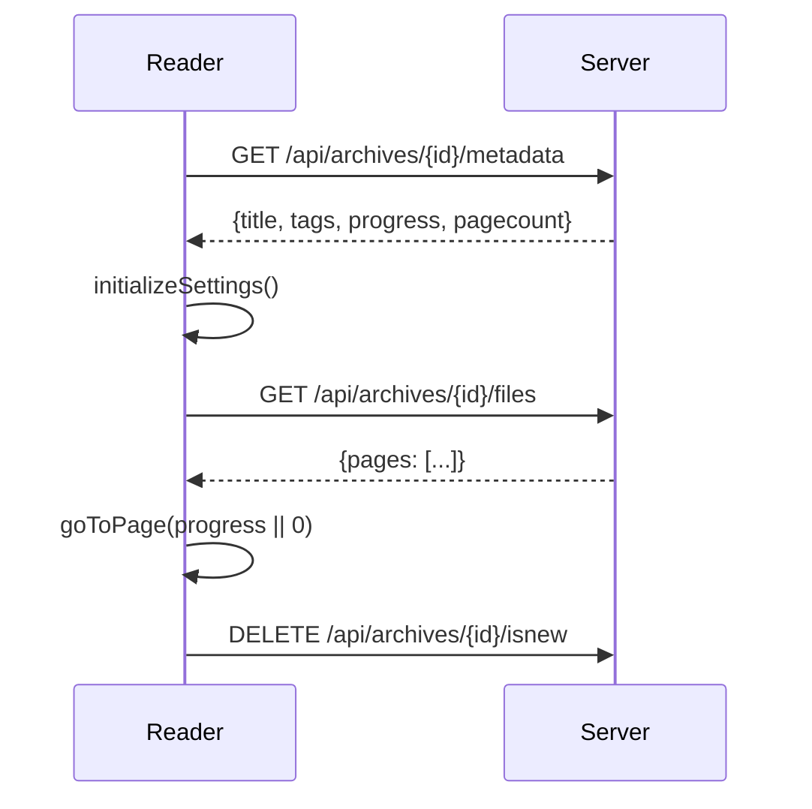
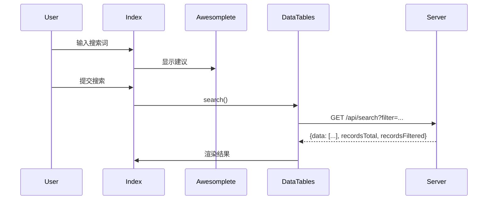

# Phase 5: Frontend 前端架构分析

> 分析时间: 2026-01-11

本文档分析 LANraragi 的 JavaScript 前端架构，为 Go 重构或前端现代化提供技术参考。

---

## 📊 核心模块概览

| 文件 | 行数 | 主要职责 | 关键依赖 |
|------|------|----------|----------|
| `common.js` | 486 | 全局工具函数、UI 组件构建 | jQuery, React (toast), SweetAlert2 |
| `server.js` | 346 | API 客户端、异步任务轮询 | fetch API, LRR 命名空间 |
| `reader.js` | 1143 | 阅读器核心逻辑 | fscreen (全屏), LRR/Server |
| `index.js` | 1040 | 首页/列表页逻辑 | DataTables, Swiper, Awesomplete |
| `index_datatables.js` | 413 | **DataTables 配置与渲染** | DataTables, tippy.js |
| `batch.js` | ~350 | 批量标签操作 | Server API |
| `category.js` | ~300 | 分类管理页面 | Server API |
| `edit.js` | ~250 | 元数据编辑 | Server API |
| `upload.js` | ~230 | 上传功能 | Server API |
| `duplicates.js` | ~300 | 重复检测页面 | Server API |
| `config.js` | ~180 | 设置页面 | Server API |
| `stats.js` | ~50 | 统计页面图表 | Server API |
| `plugins.js` | ~35 | 插件管理 | Server API |
| `logs.js` | ~45 | 日志页面 | Server API |
| `backup.js` | ~30 | 备份页面 | Server API |

---

## 📊 index_datatables.js - 表格核心 (16KB)

### 模块结构

```javascript
const IndexTable = {
    dataTable: {},           // DataTables 实例
    originalTitle: "",       // 原始页面标题
    isComingFromPopstate: false,  // 浏览器历史状态
    currentSearch: ""        // 当前搜索词
};
```

### DataTables 配置

```javascript
IndexTable.dataTable = $(".datatables").DataTable({
    serverSide: true,        // 服务端分页
    processing: true,
    ajax: { url: "search", cache: true },
    deferRender: true,       // 延迟渲染
    lengthChange: false,
    pageLength: Index.pageSize,
    order: [[0, "asc"]],     // 默认按标题排序
    columns: [
        { data: null, name: "title", render: IndexTable.renderTitle },
        { data: "tags", name: "customColumn1", render: IndexTable.renderColumn },
        { data: "tags", name: "tags", orderable: false, render: IndexTable.renderTags }
    ]
});
```

### 双视图模式

| 模式 | 存储键 | 渲染方式 |
|------|--------|----------|
| **列表模式** | `indexViewMode=0` | 标准 `<table>` 渲染 |
| **缩略图模式** | `indexViewMode=1` | 动态创建 `#thumbs_container` |

```javascript
IndexTable.createdRow = function(row, data) {
    row.id = data.arcid;
    row.classList.add('context-menu');
    if (localStorage.indexViewMode === "1") {
        // 缩略图模式：创建缩略图 div
        $("#thumbs_container").append(LRR.buildThumbnailDiv(data));
    }
};
```

### URL 状态管理

支持 pushState/popState 保持搜索状态：

```javascript
// URL 参数构建
IndexTable.buildURLParameters = function() {
    return `?p=${page}&sort=${sortby}&sortdir=${sortorder}&q=${search}&c=${category}`;
};

// URL 参数消费
IndexTable.consumeURLParameters = function() {
    const params = new URLSearchParams(window.location.search);
    if (params.has("q")) IndexTable.currentSearch = params.get("q");
    if (params.has("c")) Index.selectedCategory = params.get("c");
    IndexTable.doSearch(params.get("p") - 1);
};
```

## 🔧 架构分析

### 1. LRR 全局命名空间 (`common.js`)

核心工具类，被所有页面引用：

```javascript
const LRR = {};

// URL 封装类 - 处理 Base URL
LRR.apiURL = class {
    static base_url = _get_baseurl_cookie();
    constructor(load_url) { ... }
    toString() { return LRR.apiURL.base_url + this.load_url; }
};
```

**关键功能:**

| 函数 | 用途 |
|------|------|
| `isUserLogged()` | 从 `data-user-logged` 获取登录状态 |
| `splitTagsByNamespace(tags)` | 解析 `namespace:tag` 格式 |
| `buildTagsDiv(tags)` | 生成可点击标签 HTML |
| `buildThumbnailDiv(data)` | 构建缩略图卡片组件 |
| `getProgress(arcdata)` | 获取阅读进度（本地/服务器） |
| `showErrorToast()` / `toast()` | Toast 通知（迁移到 react-toastify） |

**数据流向:**
```
Template (tt2) → data-* 属性 → LRR.isUserLogged() → JS 逻辑
Cookie (lrr_baseurl) → LRR.apiURL.base_url → API 请求
localStorage → 阅读进度/用户偏好 → UI 状态
```

---

### 2. API 客户端 (`server.js`)

封装所有后端通信：

```javascript
const Server = {};

// 通用 API 调用
Server.callAPI(endpoint, method, successMessage, errorMessage, successCallback)

// 带请求体的 API 调用
Server.callAPIBody(endpoint, method, body, successMessage, errorMessage, successCallback)

// Minion 任务轮询
Server.checkJobStatus(jobId, useDetail, callback, failureCallback, progressCallback)
```

**API 端点使用统计:**

| 端点模式 | 调用位置 | HTTP 方法 |
|----------|----------|-----------|
| `/api/archives/{id}/metadata` | reader, index, edit | GET/PUT |
| `/api/archives/{id}/files` | reader | GET |
| `/api/archives/{id}/thumbnail` | index | GET/PUT |
| `/api/archives/{id}/progress/{page}` | reader | PUT |
| `/api/categories/{id}/{arcId}` | reader, index | PUT/DELETE |
| `/api/minion/{jobId}` | server | GET |
| `/api/search` | index | GET |
| `/api/database/stats` | index | GET |

**错误处理模式:**
```javascript
fetch(endpoint)
    .then(response => response.ok ? response.json() : { success: 0, error: ... })
    .then(data => { if (data.success) callback(data); else throw Error(data.error); })
    .catch(error => LRR.showErrorToast(errorMessage, error));
```

---

### 3. 阅读器模块 (`reader.js`)

**状态管理:**
```javascript
Reader.id = "";              // 当前 Archive ID
Reader.currentPage = -1;     // 当前页码 (0-indexed)
Reader.pages = [];           // 页面 URL 列表
Reader.preloadedImg = {};    // 预加载图片缓存
Reader.mangaMode = false;    // 右→左阅读
Reader.doublePageMode = false; // 双页模式
Reader.infiniteScroll = false; // 无限滚动
```

**键盘快捷键:**

| 按键 | 功能 |
|------|------|
| ← / A | 上一页 |
| → / D | 下一页 |
| Space | 滚动/翻页 (智能判断) |
| M | 切换漫画模式 |
| P | 切换双页模式 |
| F | 全屏 |
| Q | 打开缩略图 overlay |
| B | 切换书签 |
| R | 随机漫画 |

**图片预加载策略:**
```javascript
Reader.preloadImages = function () {
    let preloadNext = Reader.preloadCount;  // 默认预加载数量
    let preloadPrev = Reader.preloadCount == 0 ? 0 : 1;
    
    // 双页模式时翻倍
    if (Reader.doublePageMode) { preloadNext *= 2; preloadPrev *= 2; }
    
    for (let i = 1; i <= preloadNext; i++) {
        Reader.loadImage(Reader.currentPage + i);
    }
};
```

**进度追踪逻辑:**
```javascript
Reader.updateProgress = function () {
    if (Reader.authenticateProgress && LRR.isUserLogged()) {
        // 已登录用户 → 服务器存储
        Server.callAPI(`/api/archives/${Reader.id}/progress/${Reader.currentPage + 1}`, "PUT");
    } else if (Reader.trackProgressLocally) {
        // 未登录/本地模式 → localStorage
        localStorage.setItem(`${Reader.id}-reader`, Reader.currentPage + 1);
    }
};
```

---

### 4. 首页模块 (`index.js`)

**DataTables 集成:**
- 服务端分页 (`serverSide: true`)
- 自定义列排序
- 虚拟滚动 (大数据集)

**轮播图 (Carousel):**
```javascript
// Swiper 配置
Index.swiper = new Swiper(".index-carousel-container", {
    virtual: { enabled: true },  // 虚拟化渲染
    mousewheel: true,
    navigation: { nextEl: ".carousel-next", prevEl: ".carousel-prev" }
});

// 数据源切换
switch (localStorage.carouselType) {
    case "random":   endpoint = `/api/search/random?...`;
    case "inbox":    endpoint = `/api/search?newonly=true...`;
    case "ondeck":   endpoint = `/api/search?sortby=lastread`;
    case "untagged": endpoint = `/api/search?untaggedonly=true...`;
}
```

**标签自动补全:**
```javascript
Index.loadTagSuggestions = function () {
    Server.callAPI("/api/database/stats?minweight=2", "GET", null, ...,
        (data) => {
            Index.awesomplete = new Awesomplete(searchInput, {
                list: data.map(tag => ({ label: tag.text, value: tag.text })),
                filter: (text, input) => ...,
                sort: (a, b) => b.weight - a.weight  // 按权重排序
            });
        });
};
```

---

## 📦 localStorage 使用情况

| Key | 用途 | 默认值 |
|-----|------|--------|
| `indexViewMode` | 列表/缩略图视图 | `1` (缩略图) |
| `cropthumbs` | 裁剪缩略图 | `true` |
| `mangaMode` | 漫画阅读方向 | `false` |
| `doublePageMode` | 双页显示 | `false` |
| `infiniteScroll` | 无限滚动模式 | `false` |
| `{archiveId}-reader` | 阅读进度 | - |
| `bookmarkCategoryId` | 书签分类 ID | - |
| `customColumn1/2` | 自定义列命名空间 | `artist/series` |
| `carouselType` | 轮播图类型 | `ondeck` |

---

## 🔗 前后端交互流程

### 阅读器初始化


### 搜索流程


---

## ⚠️ Go 重构注意事项

### 1. Base URL 处理
当前通过 Cookie 传递 `lrr_baseurl`，Go 版本需要:
- 在模板中注入 base URL
- 或使用相对路径

### 2. 认证状态
当前通过 `data-user-logged` HTML 属性传递，选项:
- 继续使用模板注入
- 或使用 `/api/whoami` 端点

### 3. 进度存储
混合模式（localStorage + 服务器），需保持兼容:
```javascript
if (authenticatedProgress && isLoggedIn) → Server
else if (localProgress) → localStorage
else → Server (匿名)
```

### 4. Minion 任务轮询
当前使用轮询方式，可考虑:
- WebSocket 实时推送
- Server-Sent Events (SSE)

---

## 📄 页面模块分析

以下是 Phase 5 原遗漏的前端页面模块分析：

### batch.js - 批量操作 (336行, 11KB)

**状态管理:**
```javascript
const Batch = {};
Batch.treatedArchives = 0;
Batch.totalArchives = 0;
Batch.currentOperation = "";  // "plugin" | "delete" | "tagrules" | "addcat" | "clearnew"
Batch.currentPlugin = "";
```

**WebSocket 通信:**
- 使用 WebSocket 连接 `/batch/socket` 进行实时任务推送
- 支持操作：插件执行、删除、标签规则、添加到分类、清除新标记
- 每次操作完成后自动清除搜索缓存

**关键流程:**
1. 加载所有档案列表 (`/api/archives`)
2. 自动勾选未标记档案 (`/api/archives/untagged`)
3. 通过 WebSocket 逐个处理选中档案
4. 实时更新进度条和日志

### category.js - 分类管理 (254行, 9KB)

**状态管理:**
```javascript
const Category = {};
Category.categories = [];  // 客户端缓存的分类列表
```

**核心功能:**
- 创建静态/动态分类
- 查看/编辑分类详情
- 管理分类内的档案列表
- 书签链接功能 (localStorage + API)

**API 交互:**
| 操作 | 端点 | 方法 |
|------|------|------|
| 获取列表 | `/api/categories` | GET |
| 创建 | `/api/categories?name=...&search=...` | PUT |
| 更新 | `/api/categories/{id}?name=...` | PUT |
| 删除 | `/api/categories/{id}` | DELETE |
| 添加档案 | `/api/categories/{catId}/{arcId}` | PUT |
| 移除档案 | `/api/categories/{catId}/{arcId}` | DELETE |

### edit.js - 元数据编辑 (244行, 7KB)

**标签输入:**
- 使用 `tagger` 库实现富文本标签编辑
- 支持自动补全 (基于 `/api/database/stats`)
- 粘贴自动拆分逗号分隔的标签

**插件集成:**
```javascript
Edit.runPlugin = function () {
    Edit.saveMetadata().then(() => Edit.getTags());
};
// 先保存当前元数据，再运行插件获取新标签
```

**API 交互:**
| 操作 | 端点 | 方法 |
|------|------|------|
| 保存元数据 | `/api/archives/{id}/metadata` | PUT |
| 运行插件 | `/api/plugins/use?plugin=...&id=...` | POST |
| 删除档案 | `/api/archives/{id}` | DELETE |

### upload.js - 上传功能 (178行, 7KB)

**文件上传:**
- 使用 `jquery-file-upload` 插件
- 支持分类选择 (`catid` 参数)
- 上传后通过 Minion Job 异步处理

**URL 下载:**
```javascript
Upload.downloadUrl = function () {
    // 每行一个 URL，并行提交到 /api/download_url
    $("#urlForm").val().split(/\r|\n/).forEach((url) => { ... });
};
```

**进度追踪:**
- `processingArchives`: 处理中
- `completedArchives`: 已完成
- `failedArchives`: 失败
- 使用 `Server.checkJobStatus()` 轮询 Minion 任务状态

---

## 📋 前端依赖清单

| 库 | 版本 | 用途 |
|----|------|------|
| jQuery | 3.x | DOM 操作 |
| DataTables | 1.x | 表格组件 |
| Swiper | 8.x | 轮播图 |
| Awesomplete | 1.x | 自动补全 |
| SweetAlert2 | 11.x | 弹窗组件 |
| react-toastify | 9.x | Toast 通知 |
| fscreen | 1.x | 全屏 API |
| ClipboardJS | 2.x | 剪贴板操作 |
| marked | 4.x | Markdown 渲染 |
| context-menu | 2.x | 右键菜单 |
