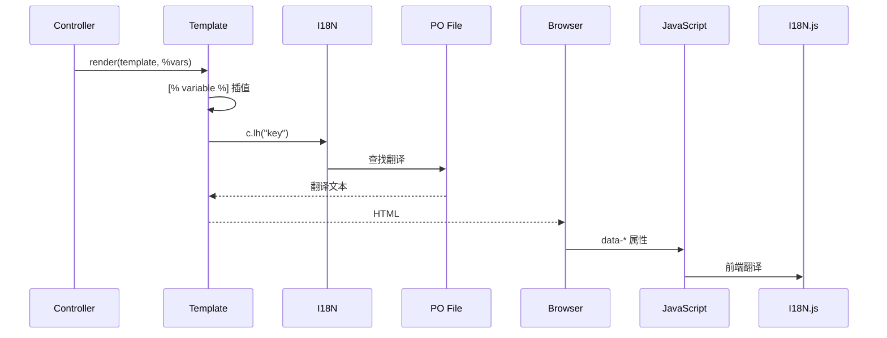

# Phase 7: 模板与国际化系统分析

> 分析时间: 2026-01-11

本文档分析 LANraragi 的 Template Toolkit 模板系统和 I18N 国际化实现。

---

## 📊 模板文件概览 (共 19 + 6 子模板)

### 主要模板

| 模板 | 大小 | 主要功能 |
|------|------|----------|
| `index.html.tt2` | 12 KB | 首页/档案列表 |
| `reader.html.tt2` | 16 KB | 阅读器页面 |
| `config.html.tt2` | 6 KB | 设置页面 |
| `plugins.html.tt2` | 9 KB | 插件管理 |
| `batch.html.tt2` | 9 KB | 批量操作 |
| `category.html.tt2` | 7 KB | 分类管理 |
| `duplicates.html.tt2` | 9 KB | 重复检测 |
| `edit.html.tt2` | 6 KB | 元数据编辑 |
| `upload.html.tt2` | 5 KB | 上传页面 |
| `stats.html.tt2` | 5 KB | 统计页面 |
| `backup.html.tt2` | 4 KB | 备份页面 |
| `logs.html.tt2` | 4 KB | 日志查看 |
| `login.html.tt2` | 2 KB | 登录页面 |
| `i18n.html.tt2` | 13 KB | 语言选择 (JS 翻译) |

### OPDS 模板

| 模板 | 大小 | 功能 |
|------|------|------|
| `opds.html.tt2` | 4 KB | OPDS 目录 (Atom XML) |
| `opds_entry.html.tt2` | 2 KB | OPDS 条目 |

### 公共组件

| 模板 | 功能 |
|------|------|
| `footer.html.tt2` | 页脚 |
| `exception.production.html.ep` | 生产环境错误页 |
| `not_found.production.html.ep` | 404 页面 |

### 配置子模板 (`templates/templates_config/`)

| 模板 | 功能 |
|------|------|
| `config_files.html.tt2` | 文件/文件夹设置 |
| `config_global.html.tt2` | 全局设置 |
| `config_security.html.tt2` | 安全设置 |
| `config_shinobu.html.tt2` | Shinobu 文件监控设置 |
| `config_tags.html.tt2` | 标签规则设置 |
| `config_theme.html.tt2` | 主题/外观设置 |

## 🔧 模板语法

### 1. 变量插值
```html
<title>[% title %]</title>
<h1>[% motd %]</h1>
```

### 2. 条件判断
```html
[% IF userlogged %]
    <a href="/upload">Add Archives</a>
[% ELSE %]
    <a href="/login">Admin Login</a>
[% END %]
```

### 3. 循环迭代
```html
[% FOREACH categories %]
    <option value="[% id %]">[% name %]</option>
[% END %]
```

### 4. 模板包含
```html
[% INCLUDE footer %]
[% INCLUDE config %]
```

### 5. 块定义 (BLOCK)
```html
[% BLOCK arrows %]
<div class="paginator">
    <a class="fa fa-angle-left page-link" value="left"></a>
    <a class="fa fa-angle-right page-link" value="right"></a>
</div>
[% END %]
```

### 6. URL 生成
```html
<link rel="stylesheet" href="[% c.url_for('/css/lrr.css?$version') %]" />
<a href="[% c.url_for('/reader').query(id => arcid) %]">Read</a>
```

---

## 🌐 国际化系统

### 后端实现 (`I18N.pm`)

基于 `Locale::Maketext` + PO 文件:

```perl
use Locale::Maketext::Lexicon {
    en => [ Gettext => "../../locales/template/en.po" ],
    zh => [ Gettext => "../../locales/template/zh.po" ],
    # ... 更多语言
    _auto => 0,  # 不自动生成缺失翻译
};
```

### 模板中调用

```html
<a href="/upload">[% c.lh("Add Archives") %]</a>
<input value='[% c.lh("Apply Filter") %]' />
```

### 前端 I18N (`i18n.js`)

JavaScript 端维护独立的翻译对象:

```javascript
const I18N = {
    ConfirmYes: "Yes",
    ConfirmDestructive: "Are you sure?",
    GenericReponseError: "Server error",
    // ...
};
```

### 支持的语言 (14种)

| 代码 | 语言 | 文件 |
|------|------|------|
| `en` | 英语 | `en.po` |
| `zh` | 简体中文 | `zh.po` |
| `zh_Hant` | 繁体中文 | `zh_Hant.po` |
| `ja` | 日语 | `ja.po` |
| `ko` | 韩语 | `ko.po` |
| `de` | 德语 | `de.po` |
| `fr` | 法语 | `fr.po` |
| `es` | 西班牙语 | `es.po` |
| `it` | 意大利语 | `it.po` |
| `pt` | 葡萄牙语 | `pt.po` |
| `id` | 印尼语 | `id.po` |
| `vi` | 越南语 | `vi.po` |
| `nb_NO` | 挪威语 | `nb_NO.po` |
| `as` | 阿萨姆语 | `as.po` |

---

## 📝 模板变量

### 全局变量

| 变量 | 来源 | 用途 |
|------|------|------|
| `title` | Controller | 页面标题 |
| `version` | Controller | 版本号 (Cache Busting) |
| `userlogged` | Session | 登录状态 |
| `csshead` | Config | 自定义 CSS (主题) |
| `motd` | Config | 首页消息 |

### Reader 专用变量

| 变量 | 用途 |
|------|------|
| `id` | 当前 Archive ID |
| `use_local` | 本地进度模式 |
| `auth_progress` | 认证进度模式 |
| `categories` | 可用分类列表 |
| `arc_categories` | 当前档案所属分类 |

### Index 专用变量

| 变量 | 用途 |
|------|------|
| `categories` | 分类列表 |
| `usingdefpass` | 使用默认密码警告 |

---

## 🔄 数据传递流程



---

## ⚠️ Go 重构要点

### 1. 模板引擎选择

| 方案 | 优点 | 缺点 |
|------|------|------|
| `html/template` | Go 标准库 | 语法差异大 |
| `pongo2` | 类 Django/Jinja2 | 接近 TT2 语法 |
| `plush` | 灵活 | 较新，社区较小 |

**推荐:** `pongo2`，语法与 Template Toolkit 最接近

### 2. 模板语法迁移

| TT2 | Pongo2 |
|-----|--------|
| `[% var %]` | `{{ var }}` |
| `[% IF cond %]` | `` |
| `[% FOREACH items %]` | `` |
| `[% INCLUDE file %]` | `` |
| `[% BLOCK name %]` | `` |

### 3. I18N 迁移

**推荐方案:** `github.com/nicksnyder/go-i18n`

```go
// 加载翻译
bundle := i18n.NewBundle(language.English)
bundle.LoadMessageFile("locales/zh.toml")

// 模板函数
localizer := i18n.NewLocalizer(bundle, "zh")
tmpl.Funcs(template.FuncMap{
    "lh": func(key string) string {
        return localizer.MustLocalize(&i18n.LocalizeConfig{MessageID: key})
    },
})
```

### 4. URL 生成

需要实现类似 `url_for` 的路由反向查找:

```go
// Gin 示例
tmpl.Funcs(template.FuncMap{
    "urlFor": func(name string, params ...string) string {
        return router.Routes().ByName(name).Path(params...)
    },
})
```

---

## 📝 I18N 贡献指南 (官方)

### 翻译方式: Weblate

官方翻译托管: https://hosted.weblate.org/projects/lanraragi/lanraragi-source/

### .po 文件格式

```
# 注释
msgid "Database Backup/Restore"
msgstr "数据库备份/恢复"
```

| 元素 | 说明 |
|------|------|
| `msgid` | 原始英文文本 (必须精确匹配) |
| `msgstr` | 翻译后的文本 |

### 占位符语法

**在模板 (HTML) 中:**
```html
[% c.lh("Version [_1] [_2]", version, vername) %]
```

**在 .po 文件中:**
```
msgid "Version %1 %2"
msgstr "版本 %1 %2"
```

**在 JavaScript 中:**
```javascript
// i18n.html.tt2
I18N.BatchChangedTitle = (title) => `[% c.lh("Changed title to: \${title}") %]`;
```

```
msgid "Changed title to: \${title}"
msgstr "标题已更改为: ${title}"
```
> 注意: `\` 仅在 msgid 中，msgstr 中不需要

### 特殊情况

`~` 在 Locale::Maketext 中是转义字符:
```
msgid "namespace : strips the namespace from the tags"
msgstr "<b>~namespace</b> : strips the namespace from the tags"
```

---

## 📋 迁移清单

- [ ] 选择 Go 模板引擎 (pongo2)
- [ ] 迁移 18 个模板文件
- [ ] 实现 `c.url_for()` 等效函数
- [ ] 迁移 I18N 到 go-i18n
- [ ] 转换 14 个 PO 文件格式
- [ ] 迁移前端 i18n.js

